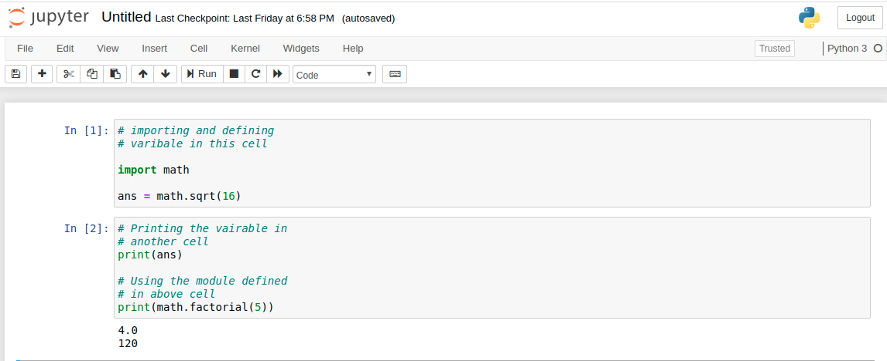
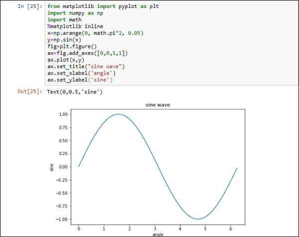

# 0.6 Jupyter Notebooks

Jupyter Notebooks are an alternative way of writing Python code where commands are written and executed in sets or 
sequences, with their result or output displayed in the same document.

Similar to, but perhaps even better than the interactive terminal, Jupyter notebooks can be a very easy way to 
quickly create some code and see it's output. It can be a nice tool for testing a simple idea, visualizing some output, 
or communicating the results of some code.

However, I am one of a large majority of people who think it is actually a mistake to introduce people to programming 
using Jupyter notebooks or Jupyter lab. Interactive editors like Jupyter notebooks have a number of drawbacks for those 
who are first learning to code, including:
- they promote writing disorganized code
- they make it hard to experiment with multiple versions of the same code (since each individual code block must be 
re-run separately)
- they make it harder to ensure code reproducibility if the code is not always run in the same order. A script requires 
this, but in a notebook you can run code block in any order
- they can make it harder to find errors in code
- they do not play well with other tools you may want to use with your python script

For those who are interested, a more detailed explanation of the drawbacks of the notebook approach to coding can be 
found 
[here](https://towardsdatascience.com/5-reasons-why-you-should-switch-from-jupyter-notebook-to-scripts-cb3535ba9c95):

We these reasons and many more, we won't be using Jupyter notebooks in this class. If you want to learn them on your 
own later, great! Once you have mastered Python programming using scripts, learning how to use a Jupyter notebook will 
be easy, and you will then already have developed some of the good programming practices that will help you avoid some 
of the problems listed above.

Next: [0.7. Other Useful Tips](0.7.%20Other%20Useful%20Tips.md)
Previous: [0.5. The Interactive Shell](0.5.%20The%20Interactive%20Shell.md)