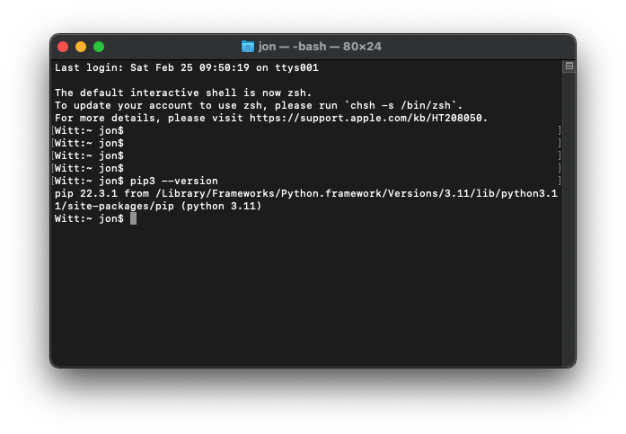

# 5.1 Numpy

Pip is the name of the program that you run in the terminal to install extra python modules. Pip3 (the version of pip 
for installing packages with python v3) comes installed with python 3 on many machines.

## Making Sure pip3 is installed

To see if you have pip3 installed on your machine, go to your terminal and type
```text
pip3 --version
```
If it is installed you should see something like this:



Note that at the end of the output, it says what version of python pip3 is configured for. Make sure it is 
python 3.11 (or whatever version of python you are using).

If pip3 is not installed, you will see a message saying that the command pip3 is not recognized.

If you have Windows, this almost certainly worked. But sometimes on Unix and Mac, pip3 may not install 
automatically. If that happened to you, go to the terminal and type:

```text
curl https://bootstrap.pypa.io/get-pip.py -o get-pip.py
```
After it has finished downloading, then type the following in your terminal:
```text
python3.11 get-pip.py
```
It should now output as shown above, and be configured to work with 

## Installing Modules with Pip3

Now that pip3 is installed, adding modules is easy. Let's start with numpy. At the terminal, type:
```text
pip3 install numpy
```

You should see it download and install. You can verify that it worked by opening up the interactive python 
terminal and typing "import numpy". If you get an error saying "ModuleNotFoundError: No module named numpy"
then there was a problem. Otherwise, you're good to go!

Next: [5.2. Numpy](5.2.%20Numpy.md)<br>
Previous: [5.0 Core Python Modules](5.0.%20Core%20Python%20Modules.md)
