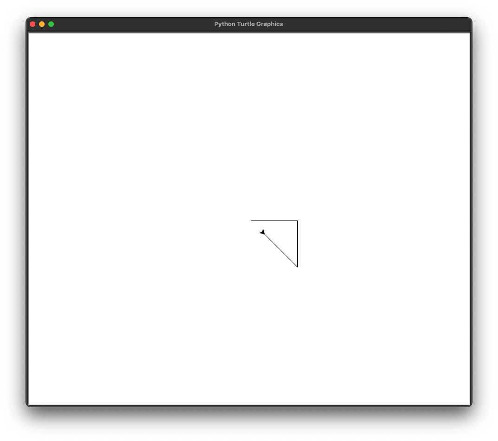
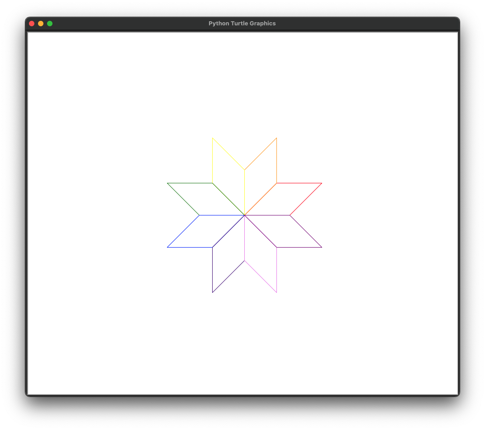

# 6.4. Turtle

### The Turtle library
The turtle library in python lets you create pictures and shapes by providing them with a virtual canvas. It is all 
drawn by creating instances of a "turtle" object on a drawing canvas.

```python
import turtle
t = turtle.Turtle() # Create a turtle object
t.forward(100) # Move the turtle forward
t.right(90) # Rotate the turtle right by 90 degrees
t.forward(100) # Move the turtle forward again
t.left(45) # Rotate the turtle left by 45 degrees
t.backward(100) # Move the turtle backward
turtle.mainloop()  # keeps the turtle window from closing at the end
```



Turtle can be used to draw pictures in all sorts of fun algorithmic ways:
```python
import turtle

# Create a turtle object
t = turtle.Turtle()

# Define the colors for each petal
colors = ["red", "orange", "yellow", "green", "blue", "indigo", "violet", "purple"]

# Loop to draw each petal
for i in range(8):
    # Set the pen color for the current petal
    t.pencolor(colors[i])

    # Draw a petal
    t.forward(100)
    t.left(45)
    t.forward(100)
    t.left(135)
    t.forward(100)
    t.left(45)
    t.forward(100)
    t.left(135)

    # Rotate to the next petal position
    t.left(45)

t.hideturtle() # Hide the turtle
turtle.mainloop()
```


### Turtle Attributes and Methods

A turtle is a class, and the lines in the programs above `t = turtle.Turtle()` create an instance of that class, which 
places it the center of a window. Turtle's have attributes like their shape, size, and color, and they have attributes
like moving (which draws by default), rotating, and many more.

Here are some examples of attributes and methods for turtle objects:

```python
import turtle

# Create turtle objects
t1 = turtle.Turtle()
t2 = turtle.Turtle()

t1.speed(3)  # Change the speed attribute
t1.color("blue")  # Change the color attribute
t1.pensize(3)  # Change the pensize attribute
t1.setpos(100, 100)  # Change the position attribute, without drawing if pen is down
t1.goto(100, 200)  # change the position attribute, drawing along the way
t1.setheading(90)  # Change the heading attribute
t1.penup()  # Change the "isdown" attribute to false, which will stop the turtle from drawing if it moves
t1.pendown()  # Change the "isdown" attribute to True, which will make the turtle draw
t1.showturtle()  # make the turtle visible
t1.hideturtle()  # make the turtle invisible

turtle.register_shape("custom_shape", "path/to/your/image.gif")  # load a custom graphic into turtle
t1.shape("custom_shape")  # set your turtle to the custom graphic

# Some turtle methods can take another turtle as an argument
# Calculate the angle from t1 towards t2
angle = t1.towards(t2)
print("Angle from t1 towards t2:", angle)

dist = t1.distance(t2)
print("Distance from t1 to t2:", dist)

t1.setheading(angle) # point t1 in the direction angle, which will point it at t2
t1.forward(dist)  # will move t1 forward the distance between it and t2
```

Next: [6.5. Lab 6](6.5.%20Lab%206.md)<br>
Previous: [6.3 Class Inheritance](6.3.%20Class%20Inheritance.md)
