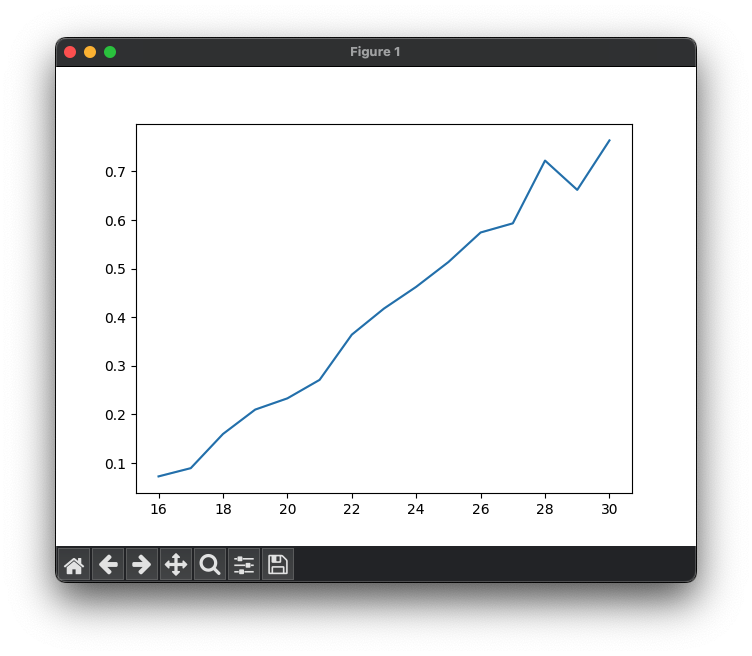
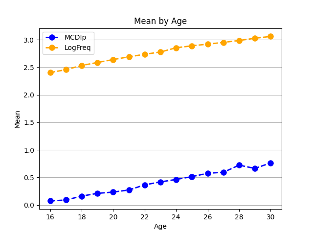

# 10.4. Simple Matplotlib Plots
Matplotlib is a Python library for creating static, interactive, and animated visualizations. Here we are 
going to use our mcdi dataset to create commonly used plot types including bar, histogram, line and scatter plots. 
To begin make sure to import the matplotlib module as follows.

```python
import matplotlib.pyplot as plt
```
Typing matplotlib.pyplot every time is annoying, so it is pretty standard to see people create the plt shortcut.

# Line Plots
The simplest way to create a line plot is just to call the plt.plot() function, and pass it in a list of x-coordinates, 
and a list of y-coordinates, and it will draw the line plot.

Let's combine that with our new pandas skills to create a plot of the average MCDIp score from our dataset. Remember, 
the MCDIp score for each word is the percentage of children at a given age who say that word. So here, we are going to 
compute the average MCDIp score across all 500 words at each age. 

So first we use a pandas statement to create a new dataframe that has that data, using the groupby() function and 
telling it we want the mean() of MCDIp.
```python
# calculate the mean frequency for each age group
mean_mcdip_by_age = mcdi_df.groupby('Age')['MCDIp'].mean()
print(mean_mcdip_by_age)
```
Print Output:
```text
Age
16    0.072588
17    0.089531
18    0.159805
19    0.210012
20    0.233139
21    0.271172
22    0.364170
23    0.417908
24    0.462604
25    0.513568
26    0.574354
27    0.593179
28    0.722286
29    0.662010
30    0.763803
Name: MCDIp, dtype: float64
```
You can see this gives us a data frame with only one column of data (the mean MCDIp score). It uses the groupby() 
variable (in this case, age) as the index column. We can now use those two columns as our x and y variables to create a 
line plot. You can pass a matplotlib plot any iterable sequence of numbers, a list, an array, or a set. But the easiest 
thing to do is just to pass it a column from a pandas dataframe. You can do this by just typing the name of the 
dataframe followed by a period, followed by the column name. IN this case, our column names are "index" and "values" 
because our dataframe was a single column of data with an index.
```python
# create scatter plot
plt.plot(mean_mcdip_by_age.index, mean_mcdip_by_age.values)
plt.show()
```
Output:\


The plot connects the data points with lines, visualizing the relationship between age and mean word frequency. And 
while this is a nice first effort, the plot is quite bare. It violates the first rule of making science graphs: LABEL 
YOUR AXES!.

Luckily we can add labels for each axis to improve the readability. Some options, like those specifying the color, 
thickness, and style of the line, and whether the line has markers at our data points, can be specified when you create 
the line. Other properties, like those labeling the axes and the figure itself, must be set separately.

```python
plt.plot(mean_mcdip_by_age.index, mean_mcdip_by_age.values,
         color='red', linestyle='--', linewidth=2, marker='o', markersize=8)

# add labels and a title
plt.xlabel('Age (months)') # label the x axis
plt.ylabel('Mean MCDIp Score') # label the y axis
plt.ylim(0, 1) # force the y-axis to be from 0 to 1
plt.title('Mean MCDIp Score by Age') # give the figure a title
plt.grid(True, axis='y') # # add horizontal gridlines

# show the plot
plt.show()
```
Output:\


We can create a line plot that has more than one line. First, let's create a new data frame that gets us the average
at different ages of two of our variables.
```python
cols = ['MCDIp', 'LogFreq']
mean_df = mcdi_df.groupby('Age')[cols].mean()
mean_df = mean_df.reset_index() # insert a new numbered index into the new dataframe
print(mean_df)
```
output:
```text
    Age     MCDIp   LogFreq
0    16  0.072588  2.403829
1    17  0.089531  2.455150
2    18  0.159805  2.532085
3    19  0.210012  2.585922
4    20  0.233139  2.639456
5    21  0.271172  2.688775
6    22  0.364170  2.735728
7    23  0.417908  2.775869
8    24  0.462604  2.853728
9    25  0.513568  2.888611
10   26  0.574354  2.919528
```
You can see that we created a list of the columns we wanted to keep, and used that list as the input input the groupby
statement.

Now we can use a for loop to add each column in our "columns" list as a line in the plot:
```python
columns = ['MCDIp', 'LogFreq']
mean_df = mcdi_df.groupby('Age')[columns].mean()
mean_df = mean_df.reset_index() # insert a new numbered index into the new dataframe

# Loop through the word statistics and plot each one
colors = ['blue', 'orange']
num_cols = len(columns)
for i in range(num_cols):
    plt.plot(mean_df['Age'], mean_df[columns[i]], 
             label=columns[i], color=colors[i], linestyle='--', linewidth=2, marker='o', markersize=8)

# add labels and a title
plt.xlabel('Age')
plt.ylabel('Mean')
plt.title('Mean by Age')

plt.legend() # add a legend
plt.grid(True, axis='y') # add horizontal grid lines

plt.show() # show the plot

```
Output:\

We can see, not surprisingly, that the cumulative frequency of a word (how many times it has occurred in speech to 
children) goes up over time, as does the percentage of children who say each word.

Want to customize your line plots even more? Check out the documentation page here: https://matplotlib.org/stable/api/_as_gen/matplotlib.pyplot.plot.html

# Histograms
Sometimes we want to get a sense of the range of scores or values for a given variable in our dataset. We can do this 
by plotting a histogram. Histograms are a graphical representation of the distribution of individual variables within 
a dataset. They display data in a series of bins or intervals, where the height of each bar represents the number of 
data points that fall into that bin. Histograms help us visualize the underlying frequency distribution of the data 
and can give insights into the data's central tendency, dispersion, and skewness.

For instance, let's plot a histogram of the frequency variable in our MCDI dataset:

```python
# Plot a histogram of word frequency
plt.hist(mcdi_df['LogFreq'], bins=20)
plt.xlabel('Word Frequency')
plt.ylabel('Count')
plt.title('Histogram of Word Frequency')
plt.show()
```
Output:\


This histogram shows that across all words and ages, word frequencies are normally distributed.

Additional customization and applications of histograms here: https://matplotlib.org/stable/gallery/statistics/hist.html
# Bar Plots

Bar plots are useful for visualizing and comparing categorical data. Let's start by creating another subset of our data:
the data for only 21 month-olds, and averaging MCDIp separately for each grammatical class at that age.

```python
mcdi_21_df = mcdi_df.query('Age == 21')
stats_by_class = mcdi_21_df.groupby('Lexical_Class')['MCDIp'].mean()
print(stats_by_class)
```
output:
```text
Lexical_Class
adjectives        0.207079
function_words    0.126022
nouns             0.354411
verbs             0.222982
Name: MCDIp, dtype: float64
```

```python
mcdi_df.plot.bar(x='Lexical_Class', y='MCDIp', rot=0)
plt.set_xlabel('Lexical Class')
plt.set_ylabel('Mean MCDIp')
plt.set_title('Mean MCDIp by Lexical Class at 21 months')
plt.show()
```
Output:\


We could make this graph look a little nicer, with some different colors and error bars. We calculate standard error 
bars (the standard deviation divided by the square root of the sample size) using another pandas groupby operation.
Note 
```python
import numpy as np
# Calculate the standard error and 95% confidence intervals for each lexical class
n_by_class = mcdi_df.groupby('Lexical_Class')['FQ'].count()
stderr_by_class = mcdi_df.groupby('Lexical_Class')['FQ'].std() / np.sqrt(n_by_class)

# Set custom colors
colors = ['blue', 'orange', 'green', 'red']

# Plot the bar chart with error bars
plt.bar(mean_freq_by_class.index, mean_freq_by_class.values, 
        yerr=stderr_by_class, color=colors, capsize=5, edgecolor='black')

# Add labels and a title
plt.xlabel('Lexical Class')
plt.ylabel('Mean Word Frequency')
plt.title('Mean Word Frequency by Lexical Class')

# Show the plot
plt.show()
```
Output:\


You can find additional information about bar plots and customization here: https://matplotlib.org/stable/api/_as_gen/matplotlib.pyplot.bar.html. 

# ScatterPlots
The last graph we want to show is a scatterplot. Scatterplots are useful for visualizing the relationship between 
two numerical variables. They can help us identify trends, correlations, and potential outliers in the data. Here is 
a plot that examines the relationship between a words frequency and its MCDIp score.

```python
mcdi_24_df = mcdi_df.query('Age == 24')

# Create a scatter plot
plt.scatter(mcdi_24_df['LogFreq'], mcdi_24_df['MCDIp'])

# Add labels and a title
plt.xlabel('Word Frequency')
plt.ylabel('MCDIp')
plt.title('MCDIp vs. Log Frequency')

# Show the plot
plt.show()
```
Output:\


This graph has 500 different points, since there are 500 different words. It makes it hard to see that there is a 
strong relationship here (remember the correlation was quite high from your homework). But in your homework, we were 
only looking at the 250 or so nouns. This dataaset also has function words, adjectives, and verbs. Maybe the 
relationship will become more apparent if we plot each type of word in a different color?

To do that, first we want to get the unique list of grammatical classes. Then we can create a unique color for each one.
Then we just loop through the lists and add each one to the scatter plot. Each time we make the scatterplot, we can 
specify the color of the dots using the 'c' parameter, and specify the label that will show up in the legend for those 
dots with the 'label' parameter.
```python
class_values = mcdi_24_df['Lexical_Class'].unique()
num_classes = len(class_values)
colors = plt.cm.Set2(np.linspace(0, 1, num_classes))

for i in range(num_classes):
    class_data = mcdi_24_df[mcdi_df['Lexical_Class'] == class_values[i]]
    plt.scatter(class_data['LogFreq'], class_data['MCDIp'], c=colors[i], label=class_values[i])

plt.legend() # Add a legend

# Add labels and a title
plt.xlabel('Log Frequency')
plt.ylabel('MCDIp')
plt.title('MCDIp vs. Log Frequency')

plt.show() # Show the plot
```
Output:\

Now that's a good-looking figure! You can now see a pronounced relationship with each class of words. The more 
frequently children hear specific nouns, the more likely children are to produce those nouns themselves. Ditto for 
verbs, function words, and adjectives. But this only holds within the grammatical categories. Function words like "the"
and "and" are much more frequent than most nouns, but are produced less than nouns, and the same is true for verbs and 
adjectives. This is called "Simpson's Paradox" (not named after Homer...). What looks like no correlation in a big 
dataset becomes one when that dataset is broken down into subgroups.

We can see this in numbers too, by computing the correlations in pandas:
```python
# Compute the correlation across all rows
correlation = mcdi_24_df['MCDIp'].corr(mcdi_24_df['LogFreq'])
print(f"Correlation between MCDIp and LogFreq across words: {correlation:.2f}")

grouped = mcdi_24_df.groupby('Lexical_Class')
for name, group in grouped:
    correlation = group['MCDIp'].corr(group['LogFreq'])
    print(f"Correlation between MCDIp and LogFreq for {name}: {correlation:.2f}")
```
output:
```text
Correlation between MCDIp and LogFreq across all rows: 0.13
Correlation between MCDIp and LogFreq for adjectives: 0.36
Correlation between MCDIp and LogFreq for function_words: 0.40
Correlation between MCDIp and LogFreq for nouns: 0.77
Correlation between MCDIp and LogFreq for verbs: 0.44
```

More on scatterplots can be found here: https://matplotlib.org/stable/api/_as_gen/matplotlib.pyplot.scatter.html

Next: [10.5. SubPlot Figures](10.5.%20Simple%20Matplotlib%20Plots.md)<br>
Previous: [10.3. Pandas Operations](10.3.%20Pandas%20Operations.md)
