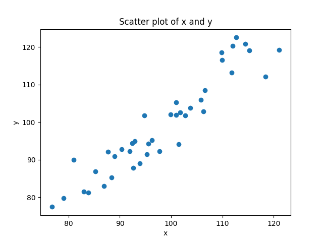
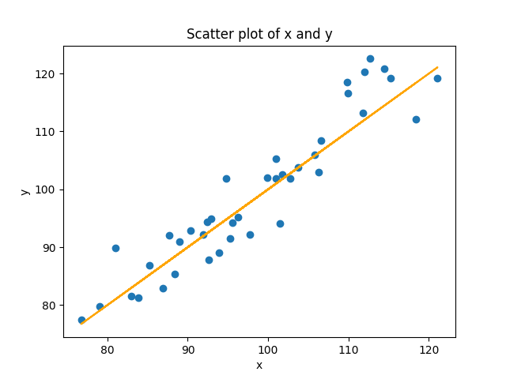
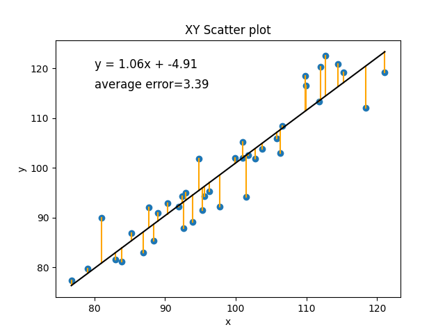
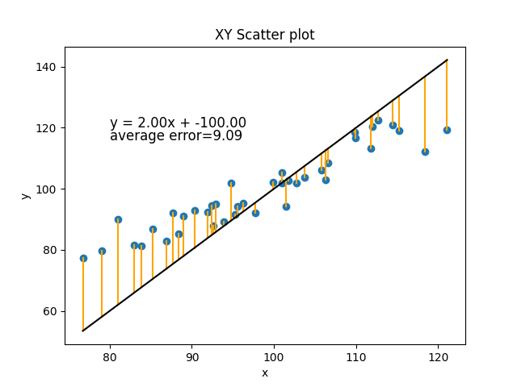
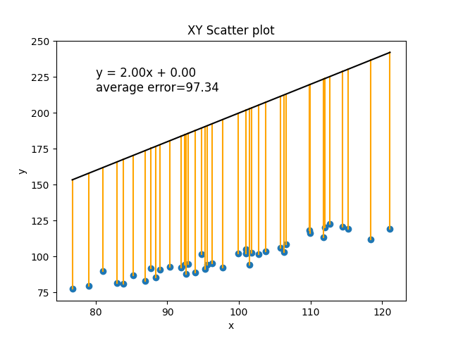

# 11.1. Two Variable Linear Regression

We are going to start with basic linear regression where we are trying to predict a single output variable. Most people 
would call this "statistics", not "machine learning", but it's a good place to start. In this example, we are actually 
going to program everything ourselves from scratch so that we can really understand the concepts. We will then conclude 
by showing you the easy way to do it in scikit-learn. In the future sections, we will use scikit-learn for almost 
everything, but we can refer back to this example to understand the main concepts.

In linear regression, we have data from two variables (x and y) and we are trying to predict y using x. This might be 
trying to predict:
- the number of times a rod or cone in the eye fires as a function of the brightness of a stimulus
- amount of fMRI brain activity in a brain region as a function of how surprising a stimulus is
- what percentage of children say a word as a function of the amount of times children hear that word
- amount of depression as a function of amount of sleep and exercise

There are a couple basic concepts to understand about regression.
- we have data that has an x and a y value, so we can view it as a scatterplot
- the more these variables are predictable in terms of each other, the more easily we should be able to fit 
some function to the data, like a line or a curve.

## Generating some correlated data

Let's start by generating some data that makes this easy and clear to see.
```python
import numpy as np
import matplotlib.pyplot as plt

x = np.random.normal(100, 10, 40) # an array of 40 random numbers with a mean of 100 and a standard deviation of 10
y = np.copy(x)  # make y a copy of x. we didn't just do y = x, because that would make a reference, not a copy

# add some random noise to y. For each element, we add a random value with a mean of zero, but with a stdev of 
# of five. So sometimes we will add a positive, sometimes a negative, and usually a small amount.

y += np.random.normal(0, 5, 40)  

plt.scatter(x, y)
plt.title("XY Scatter plot")
plt.xlabel("x")
plt.ylabel("y")
plt.show()
```


Your output if you run this code will vary slightly, of course since the numbers are generated randomly. But what 
we should expect to see is a bunch of points with x values that are centered around the mean of 100, but with some 
pattern of distribution around that. Scores as low as 70 or as high as 130 are unlikely (about a 1% chance that any 
given point will be that extreme).

We know our y values will be very correlated with x; we made it that way when we started with y as a copy of x and 
then added some noise. If we hadn't added the noise, every value of x and y would have been identical, and so every 
point would have been on a perfect line. This is what we mean when we say two variables are perfectly correlated - 
they lie on a line, with a positive slope for positive correlations (as x goes up, y goes up), and a negative slope
as if they are negatively correlated (as x goes up, y goes down). Another way to think about variables that are 
perfectly correlated and on a line is that they allow us to perfectly predict one from the other. If two variables 
form a line, then if I know the x value, and the equation of the line, I can perfectly predict the value of y (and 
vice versa).

In real life, data involving anything remotely complex (like human behavior) will never be perfectly correlated. But 
you can end up with values that are really highly correlated, as in our example. We can actually state precisely the 
relationship since we generated the numbers. The value of y is likely to be the value of x, plus or minus some number 
that has a mean of 0 and a standard deviation of 5. That means that there is about a 66% chance that y will be within 
+/- 5 of x, and a 90% chance that it will be within +/- 10 of x, and a 99% chance that it will be within +/- 15 of x.
That's how standard deviations for normal distributions work, the standard deviation tells you the probability of 
values that are different distances from the mean.

Of course in real life, we don't know the relationship ahead of time, we are trying to figure it out. So how do we 
do so?

## Linear Regression, a best fit line to data
If we don't know the relationship ahead of time, but we think there is a linear relationship between two variables (or 
we want to see if there is), then what we try to do is find the line that best models the cloud of data. Look again 
at the figure above. You can see that you could draw a line through that cloud of points. The equation for a line is 
y = mx + b. But in our case, it's really just y = x (because m = 1, and b = 0). We can add that to our scatterplot:
```python
plt.plot(x, x, color='black')
```


In the command above, I used x twice instead of y, so that it would plot the equation y = x. I didn't use y because in 
our randomized data, y doesn't precisely equal x because of the noise. In the real situation where we don't know the 
equation, how do we figure it out?

### Estimating the slope
The equation for a line is y = mx + b. m is the slope. Normally you get the slope from change in rise over change in 
run: (y2-y1)/(x2-x1). But we have more than two points. How do we get a line when we have more than two points? We use
a method called `least squares` estimation, where what we are trying to do is determine the line that has the shortest 
distance from all the points. In the case of linear equations with two variables, we can just calculate this directly.

First we multiply each value of x and y, and sum them up. When x and y are both in the same direction, each product will 
be positive, and when they are in different directions, each product will negative. The product will be bigger when 
both are big, and smaller when both are small. When we add them all up, the resulting sum will be really positive if 
values consistently in the same direction, really negative if they are consistently in opposite directions, and close 
to zero if the pattern is inconsistent, canceling out positive numbers with negative numbers.
```python
sum_of_products = np.sum(x * y) 
```

Next we sum all the x's, and sum all the y's, and then multiply these sums together. This will be bigger to the extent 
that all the numbers are bigger, and smaller to the extent that all the numbers are smaller. But since we aren't 
multiplying each individual x by each individual y, this value doesn't "know" anything about the relationship between x 
and y, just their overall size. We can use this to scale the first number, telling us if the size of the sum_of_products 
is big, relative to the overall size of the values.
```python
product_of_sums = np.sum(x) * np.sum(y)
```

The numerator of our slope is just the sum_of_products multiplied by the number of data points, and then subtracting 
the product of sums. You can think of this difference score telling you "how much do x and y vary in the same direction, 
minus their overall size" We often call this the `covariance` of x and y, scaled to the number of data points n.
```python
covariance = (n * sum_of_products) - product_of_sums
```
Next we need the denominator. The denominator pretty much identical, except that instead of giving us a number for 
the covariance of x and y, we are just looking at the variance of our predictor variable x.
```python
x_variance = (n * np.sum(x ** 2)) - (np.sum(x) ** 2)
```
You can see that we are squaring each value of x and summing them up, and subtracting from the that the square of the 
sum of the x's. This is the variance of x, scaled to the number of data points n. Conceptually, you can think about this 
by thinking about cases where the variance of x is either really high or really low. When every value of x is identical 
to the mean, the left and the right part will be identical. Consider a case with four scores of 3:
```text
n * np.sum(x ** 2)
4 * (3^2 + 3^2 + 3^2 + 3^2)
4 * (9 + 9 + 9 + 9)
4 * (36)
144

(np.sum(x) ** 2
(3 + 3 + 3 + 3)^2
12^2
144
```
At the other extreme, as the differences between the scores get higher and higher, the left side of the equation will 
get bigger, faster, resulting in a bigger value of the variance of x. Here's the same simple example, but with 
four very different numbers.
```text
n * np.sum(x ** 2)
4 * (5^2 + 2^2 + 4^2 + 8^2)
4 * (25 + 4 + 16 + 64)
4 * (109)
436

(np.sum(x) ** 2
(5 + 2 + 4 + 8)^2
19^2
361
```
Squaring numbers before you add them rises faster than squaring them after you sum them. when you square the sum of 
numbers, you are applying the squaring operation to the sum after it has already been calculated. This means that the 
contribution of each number to the sum is already equal, regardless of its magnitude. When you square the sum, the 
resulting value is simply a measure of the total size of the sum, without taking into account the individual values 
that contributed to it.

Phew. Well we now have everything we need to calculate our slope:
```python
covariance = ((n * sum_of_xy) - (x.sum() * y.sum()))
x_variance = (n * np.sum(x ** 2)) - (np.sum(x) ** 2)
m = covariance / x_variance
print(m)
```
Why does that make sense as the slope? Think of it this way. The slope is a measurement of how much y changes with 
regard to changes in x. In our new equation, our covariance is really the same idea, how much x and y change together.
The division is then just scaling that number in units of x, which is what we want, how many units does y change for 
each unit of x.

When I run this code on my data, I get a value of m = 1.06. Note this is really close to the "real" value of 1, but not 
identical. And this is because of the noise in our data. It turns out that with this data, a line with a slope of 1 is 
not quite the best fit to these data points, but instead a line with a slope of 1.06 is. If you run this code a hundred 
times, you should get values that are all centered around 1, but sometimes as low as 0.85, and sometimes as high as 
1.15.

### Calculating b, the y-Intercept
Now how do we calculate the intercept? In the basic algebra situation, remember that once you have m, you can plug in a 
single (x,y) pair and get b. The problem is that we have many (x,y) pairs, and none of them are probably exactly on the 
line, so this approach wont work. Conceptually you can think about what we need to do is sort of figure out the 
"average" (x,y) coordinate and then use that with our value of m to get b. The equation below does this, though 
we aren't going to walk through the explanation here (please ask if you are interested!).
```python
b = ((y_sum * np.sum(x ** 2)) - (x.sum * np.sum(x * y))) / ((n * np.sum(x ** 2)) - (x.sum() ** 2))
print(b)
```
With this dataset, I get a value of -4.91. So again, our value is not the exact value of 0 that goes with y=x, but it 
is very close.

Now we can get our true line as: 
```python
print("The equation of the best-fit line is: y = {:.2f}x + {:.2f}".format(m, b))
```
output:
```text
y = 1.04x + -4.91
```
## Best Fit Line Minimizes Prediction Error
Another way you can think about the best fit line in a model is that it is the line that minimizes the prediction error 
for the observed data points. Let's look at our line again:


This is the best fit line for these points because it is the line that is the closest to each of these points. We can 
estimate how good of a model this is by measuring the amount of error for each point. The error for each point is 
just, given our model and the value of x, what value would we have predicted for y, and how did that compare to the 
real value of y. Add all those differences up. Well, technically add the differences after taking the absolute value,
since we don't want negative errors (predicted value is too low) and positive errors (predicted value is too high) 
to cancel out.
```python
summed_absolute_error = 0  # set the error to 0

# loop through each (x,y)
for (xi, yi) in zip(x, y):
    y_predicted = b + (m * xi)  # get the predicted score for y, given that x
    summed_absolute_error += math.fabs(y_predicted - yi)  # get diff between the predicted and actual y, add to error
    plt.plot([xi, xi], [yi, y_predicted], color='orange')  # draw a line from that point to the regression line
average_error = summed_absolute_error/n  # divide the total error by n to get the average error

equation_text = "y = {:.2f}x + {:.2f}".format(m, b)  # add the equation to our plot
error_text = "average error={:.2f}".format(average_error)  # add the error to our plot

plt.show()
```

 
If you imagine any other line we could draw, it would have a worse fit. Let's just do a simple example with a different
m and b that we make up to be slightly different, m=2 and b=-100.



Or how about m=2 and b=0:



In the current situation, with the amount of random noise in our data, the best line we can make has an average error of 
3.39 (every real value of y was, on average, different by about 3.39 from its predicted value).

In this section we have walked through the basic concepts of regression and how to calculate the parameters of its 
best fit line (m and b), and how to use that to evaluate the error of the model. We have done this the way it is 
typically done in statistics, by calculating those parameters directly using algebra. In the next section, we will talk
briefly about why this approach doesn't scale up to more complex kinds of functions (more variables, or nonlinear 
relationships), and then introduce the "machine learning" solution to that problem.

Next: [11.2. Advanced Regression](../CH11/11.2.%20Multiple%20and%20Logistic%20Regression.md)<br>
Previous: [11.0 Machine Learning](../CH11/11.0.%20Machine%20Learning.md)
