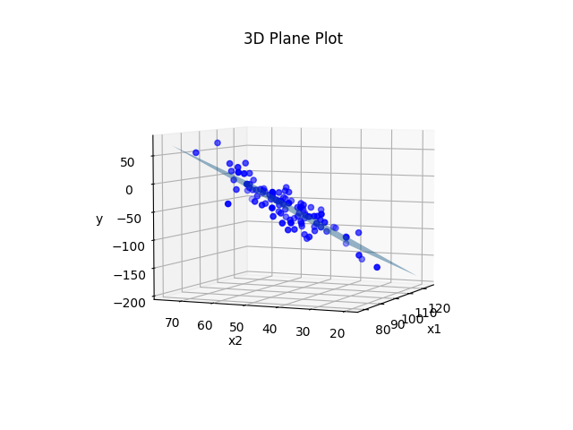
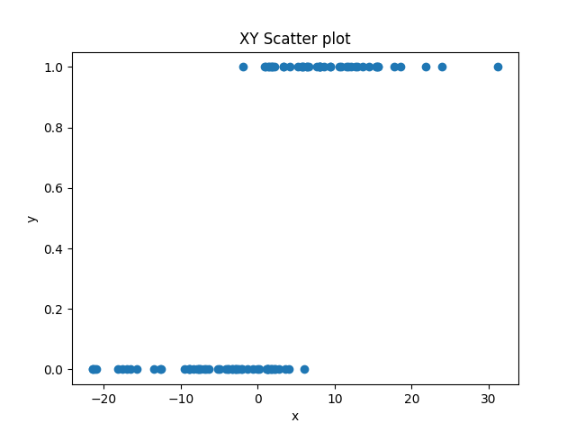
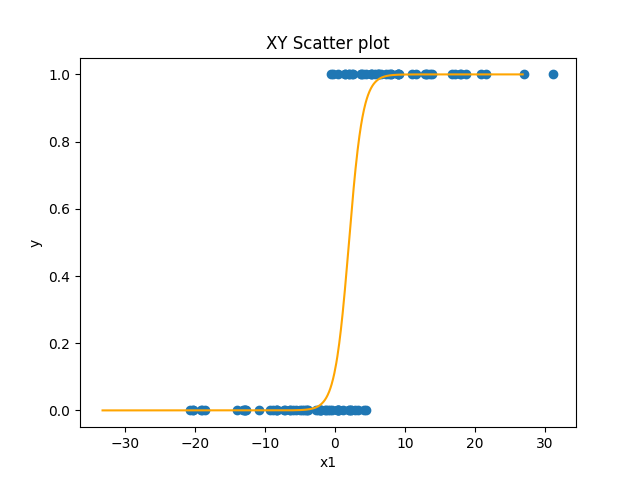
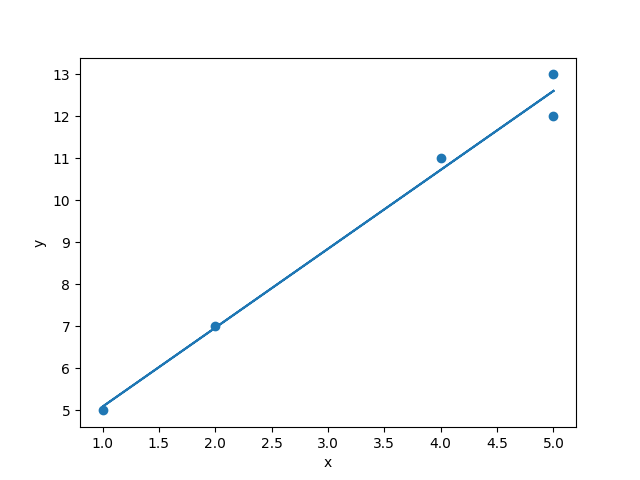

# 11.2. Multiple and Logistic Regression

In the previous section, we introduced the basic concepts of regression (predicting one variable from another), and 
showed how you create a linear model to do this. A linear model has two parameters (the slope m and the intercept b), 
which in the simple linear case can be calculated algebraically (or algorithmically using python). Now we want to expand 
to show where you can take this, but why we need to change to a different approach to figuring out what the parameters 
of the model need to be. We're going to talk about two main changes:
- multiple regression, where we have more than one predictor variable
- nonlinear regression, where we are trying to fit a curve, not just a line, to our data

## Multiple Regression
Multiple regression is conceptually very similar to linear regression. In linear regression we have the equation:
```text
y = m*x + b
```
In multiple regression, we make the formula more general:
```text
y = b0 + b1*x1 + b2*x2 + ... + bn*xn
```
As in the single predictor case, we have a single intercept. But this time we are called it b0, instead of b. This is 
because we are going to use b for all of our parameters. We have a different slope for each predictor, and so the 
slope for predictor x1 will be b1, the slope for x2 will be b2, and so on. The intercept b0 can be thought of as having 
its own predictor x0, which has a constant value of 1. In bigger models like this, the intercept b0 is also sometimes 
called the "bias" of the model, because it is biasing the value of y independently of the predictor (x) values.

Let's again generate some data to use as a simple example. We will just use two predictor variables. So this time, 
instead of trying to fit a line to our 2D (x and y) data, we will be fitting a plane to our 3D data (x1, x2, and y).
```python
n = 100
b0 = 1
b1 = -2
b2 = 3

x1 = np.random.normal(100, 10, n)
x2 = np.random.normal(50, 10, n)
y = b0 + b1*x1 + b2*x2 
noisy_y = y + np.random.normal(0, 20, n)
```
This time we will specify our parameters ahead of time. We will have an intercept (b0) of 1. The slope for x1 (b1) will 
be -2, and the slope for x2 (b2) will be 3. Our x1 and x2 variables will again be drawn from a normal distribution 
with a mean of 100 for x1 and a mean of 50 for x2, both with a standard deviation of 10. We can then calculate the 
exact values of y given the pre-defined parameters. Now let's also create a set of "noisy_y" values that add some 
noise to that. Now let's plot it.

```python
# create a 3D plot
fig = plt.figure()
ax = fig.add_subplot(111, projection='3d')  # tell matplotlib this is a 3D plot

# plot the data points
ax.scatter(x1, x2, y_noisy, c='blue')

# create a meshgrid to plot the plane y = b0 + b1*x1 + b2*x2 
x1_min, x1_max = np.min(x1), np.max(x1)
x2_min, x2_max = np.min(x2), np.max(x2)
x1_grid, x2_grid = np.meshgrid(np.linspace(x1_min, x1_max, 10), np.linspace(x2_min, x2_max, 10))
y_grid = b0 + b1*x1_grid + b2*x2_grid

# plot the plane
ax.plot_surface(x1_grid, x2_grid, y_grid, alpha=0.5)

# set the labels and title
ax.set_xlabel('x1')
ax.set_ylabel('x2')
ax.set_zlabel('y')
ax.set_title('3D Plane Plot')

plt.show()
```
Output:



Pretty much the exact same principle as before. We plotted the plane using the real values of b0, b1, and b2 that we 
used to generate the data before we added noise to the y values. We could instead treat the situation like it would be 
in real life where we don't actually know what b0, b1, and b2 are, and estimate those parameters from the data.

We could do it using the same procedure we did in the previous section. It's a little more complicated because we have 
three variables instead of two. Instead of just needing to calculate the covariance of x and y, we need to calculate the 
covariance of x1 and y, x2 and y, and x1 and x2, and use all of them together. But if we did so we would end up with an 
equation that was something close to y = 1 -2x1 + 3x2. We could use that equation to make predicted values of y for each 
set of (x1,x2), and then compare those predictions to reality to get the error of the model (i.e., on average how far 
each point is from the plane).

The same principle can be extended out to more than two predictors. But with each variable we add, we are adding even 
more covariances we need to figure out. With two predictors it is three covariances: [(x1,x2), (x1,y), (x2,y)]. With 
four predictors it is six: [(x1,x2), (x1,x3), (x2,x3), (x1,y), (x2,y), (x3, y)]. With five predictors it is ten:
[(x1,x2), (x1,x3), (x1,x4), (x2,x3), (x2,x4), (x3,x4), (x1,y), (x2,y), (x3, y), (x4, y)]. You can see that the number 
of covariances to estimate is starting to grow exponentially. This makes the algebraic solution to the problem start to 
get very computationally expensive in cases where we have many predictors. In a bit we will talk about an alternative 
technique.

## Nonlinear Regression
A second way that we can make regression more advanced is by not limiting ourselves to linear regression. Not all 
relationships are fit by a simple line. Many relationships are quadratic (i.e., u-shaped). Another very common nonlinear 
function is the one we need to use to predict qualitative outcomes. We will talk more about it in a later section, but 
we need to introduce it quickly here to make a point.

What happens if we want to predict a qualitative outcome, like:
- will the neuron fire or not?
- will a person remember a stimulus or not in a memory experiment?
- is a person likely to be depressed or not?

In this situation, all of our y-values are either 0 or 1. This will often result in data that looks like this:
.

Here, we have a predictor variable x that varies quantitatively, and an outcome variable that varies qualitatively.
As x gets bigger, y is more likely to be 1, but the relationship is not perfect. You can't just say, "if x > 2, y=1, 
else, y=0". There are some values that don't fit this.

### Sigmoid Curves
We could fit a linear regression to this data. But if you think about trying to draw a line that fit this data well, 
there would be a lot of points that were not on the line. An alternative is that we can fit a nonlinear function that 
has this shape. The most common one use in this situation is the sigmoid function:
```text
y = 1 (1 + e^-x)
```
We'll talk more about it in the next section, but the important thing for now is to see its shape:



The sigmoid function is nice because it's x-values go from negative to positive infinity, but its y-values are limited
to between 0 and 1 with a sharp nonlinear jump in the middle from one to the other. So in the simplest case (when the 
intercept is 0), when x is negative y is 0 or close to it. But right as x approaches zero from the negative side, y 
starts to go up sharply. At exactly x=0, y=0.5. And as y becomes and gets more positive, y very quickly approaches 1.
The sigmoid function has the same slope and intercept parameters that a line has. As with a line, the intercept 
parameter shifts the curve left or right. And as with a line, the slope affects the direction and steepness of the 
curve.

### Finding Parameters for Nonlinear Functions
In theory, you can find parameters algebraically for nonlinear functions like the sigmoid function, the same way we 
did for a line. But it gets much more complicated. The nice thing about a linear function is that the relationship 
between a change in x and a change in y is very, well, linear. Whether you are going from x=-4 to x=-3, or x=100 to 
x=101, in both cases there is a change in x of 1, and so there will be an identical change in y (the slope). But in 
a curve, the change in y might depend greatly on the specific value of x. In the sigmoid, if the x is very negative or 
very positive, then a change of 1 in x might involve almost no change at all in y. Whereas if x is very close to zero, 
then a change of 1 in x can involve a relatively large change in y. For this reason, direct algebraic solutions 
become difficult, and other approaches are used.

## Gradient Descent Optimization

An alternative to directly solve for an equation to find the slope and intercept in a line or curve is to use what is 
called an `optimization` process. An optimization process is some other algorithm that chooses a value for the 
parameters, and then has some algorithm by which it can nudge them in the correct direction until the right or best 
values of the parameters are found.

A common example of an optimization is called `gradient descent` learning. In gradient descent learning, we start with 
random values for our parameters and look at the error. It will probably be very high. Think about picking a random 
line to fit our linear data. Bad line. But we can actually use the information about the error for individual 
predictions (was the prediction too high or too low) to know what direction we need to adjust the parameters.

Consider the simple dataset below.
```text
x   y
5  13
2   7
1   5
4  11
5  12
```
For each of these pairs except the last one, y = 2x + 3. The last one is close but not quite the same. So how can 
we use gradient descent to find that b0=3, and b1=2? We first just choose random weights. We usually want to choose
random weights close to zero (assuming the values we are searching for will be distributed around zero), but not 
exactly zero. So maye we choose b0=1 and b1=-1. We can then go through and get predictions for each y using each x 
and the equation y = -1*x + 1. Then we can calculate the error of each prediction, by subtracting the real value of 
y from each prediction.
```text
x   y   y_pred=-x+1    error=y_pred-y
5  13        -4              -17
2   7        -1               -8
1   5         0               -5
4  11        -3              -14
5  12        -4              -16
```
Intuitively we can see that our predictions were all too low, and that what we want to do is change our parameters 
so that we make larger predictions the next time. We can manipulate both our intercept and slope parameters to do this.
But how should we change them? We can determine this algorithmically for the slope (b1) by computing the average of each 
x value multiplied by the error for that x. this is called the `gradient` for b1. We can get the gradient for our 
intercept (b0) by using the value of 1 (the value of x0) instead of the value of x (which is like x1, in this case). 
Conveniently, that is just the average of our error.
```text
x   y   y_pred=-x+1    error=y_pred-y    b1_gradient=error*x
5  13        -4              -17           -85                          
2   7        -1               -8           -16                          
1   5         0               -5            -5
4  11        -3              -14           -56
5  12        -4              -16           -80
average x1 gradient = (-85 + -16 + -5 + -56 + -80)/5 = -37.6
average x0 gradient = (-17 + -8 + -5 + -14 + -16)/5 = -9.6
```
The sign (direction) of the gradient tells us the direction we want to adjust our parameters. The magnitude tells us 
something about how much we need to change our parameters in the specified direction. The final step is to mulitply 
the gradient by what is usually called the `learning rate`, or how big of a step in the right direction we want to take.
We usually want to take small steps, for reasons we won't go into here. So we just multiply our gradient by our learning
rate (maybe a number like 0.01) and subtract that result from the parameters, to get new parameters.
```python
theta = [1, -1]
gradient = [-9.6, -37.6]
learning_rate = 0.01
theta -= gradient * learning_rate
```
That's it. That will nudge our parameters in the right direction. We can now just repeat the process over and over again,
and each time the parameters we approach the right answer. Eventually, the parameters will be close to the right answer.

Here is python code that does this:
```python
import numpy as np
np.set_printoptions(precision=3)  # makes sure that when we print a numpy matrix, only three decimals print out

x = np.array([5,2,1,4,5])
y = np.array([13,7,5,11,12])

# Initialize the parameters
theta = np.zeros([1, -1])
learning_rate = 0.1
num_iters = 400

# Add a column of ones to the input feature for the intercept term
# this makes us have a 5x2 matrix of [x0=1, x1=x] for each observation
x = np.vstack((np.ones(len(x)), x)).T

# Perform gradient descent
for i in range(num_iters):
    # Compute the predicted values
    y_pred = np.dot(x, theta)
    
    # Compute the error between the predicted values and the actual values
    error = y_pred - y
    
    # Compute the gradient of the error function with respect to each parameter
    gradient = np.dot(x.T, error) / len(x)
    
    # Update the parameters
    theta = theta - learning_rate * gradient
  
    if i % 100 == 0:
        print(i)
        print("  x0     x1     y      ypred   error")
        print(np.column_stack((x, y, y_pred, error)))
        print("gradient:", gradient)
        print("theta:", theta)
        print()

print("y = {:0.3f} + {:0.3f}x".format(theta[0], theta[1]))
```
Output:
```text
x0     x1     y      ypred   error
[[  1.   5.  13.   0. -13.]
 [  1.   2.   7.   0.  -7.]
 [  1.   1.   5.   0.  -5.]
 [  1.   4.  11.   0. -11.]
 [  1.   5.  12.   0. -12.]]
gradient: [ -9.6 -37.6]
theta: [0.96 3.76]

100
  x0     x1     y      ypred   error
[[ 1.     5.    13.    12.7   -0.3  ]
 [ 1.     2.     7.     6.742 -0.258]
 [ 1.     1.     5.     4.756 -0.244]
 [ 1.     4.    11.    10.714 -0.286]
 [ 1.     5.    12.    12.7    0.7  ]]
gradient: [-0.078  0.019]
theta: [2.778 1.984]

200
  x0     x1     y      ypred   error
[[ 1.     5.    13.    12.622 -0.378]
 [ 1.     2.     7.     6.931 -0.069]
 [ 1.     1.     5.     5.034  0.034]
 [ 1.     4.    11.    10.725 -0.275]
 [ 1.     5.    12.    12.622  0.622]]
gradient: [-0.013  0.003]
theta: [3.138 1.897]

300
  x0     x1     y      ypred   error
[[ 1.     5.    13.    12.609 -0.391]
 [ 1.     2.     7.     6.963 -0.037]
 [ 1.     1.     5.     5.081  0.081]
 [ 1.     4.    11.    10.727 -0.273]
 [ 1.     5.    12.    12.609  0.609]]
gradient: [-0.002  0.001]
theta: [3.2   1.882]

y = 3.210 + 1.879x
```
You can see that this very quickly determines that the best slope and intercept to fit this data is a line with 
a slope of 1.879 and an intercept of 3.210. Let's plot it to see:
```python
plt.scatter(x[:,1], y)
plt.plot(x[:,1], np.dot(x, theta))
plt.xlabel('x')
plt.ylabel('y')
plt.show()
```


Not too shabby. Four of the observations would have fit perfectly on the line y = 3 + 2x. But because of that fifth
point, we have to shift the equation a bit to y = 3.21 + 1.88x.

## Gradient Descent for Complex Regression

The gradient decent technique figured out a simple line, but we could have calculated that algebraically. Where 
gradient descent really shines is when you add lots of predictors, or use nonlinear functions. Remember that if we 
want to calculate b parameters algebraically for multiple predictors (b2, b3, b4, ..., bn), we have to calculate the 
covariance of each pair of predictors. But with gradient descent, we only have to modify our algorithm in a very 
small way. All we need to do is make the x array a matrix of multiple x inputs, and modify theta so that it has a 
b for each x. Then we calculate the gradient for each parameter, and we can the gradient for b2, b3, or b144 exactly 
as we got the gradients for b0 and b1. We can then nudge them exactly the same way. So gradient descent optimization
scales much better than the algebraic solution (linearly, one new computation for each new parameter, instead of 
exponentially).

Gradient descent is an even bigger deal for nonlinear functions. The technique works almost identically if we are trying
to fit points to y = 1 / (1 + e^(-x)) as it does if we are trying to do y = mx + b. The only difference is that, in the 
step where we calculate the gradient, we can't just multiply the x times the error. We need to do something more 
complex to handle the nonlinear relationship between x and y. But the technique is very simple and straightforward 
compared to the algebraic approach.

Ok, that's it for your primer on:
- how regression (predicting one variable from another) works
- how to compute parameters of linear and nonlinear regression models algebraically and using gradient descent

Now let's move on to using scikit-learn to do this quickly and easily.

Next: [11.3. Regression in sklearn](../CH11/11.3.%20Regression%20in%20sklearn.md)<br>
Previous: [11.1 Two Variable Linear Regression](../CH11/11.1.%20Two%20Variable%20Linear%20Regression.md)

