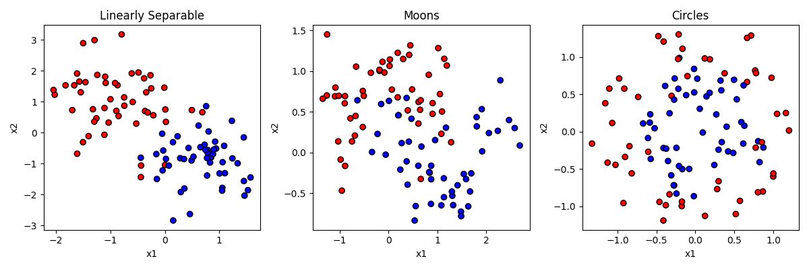
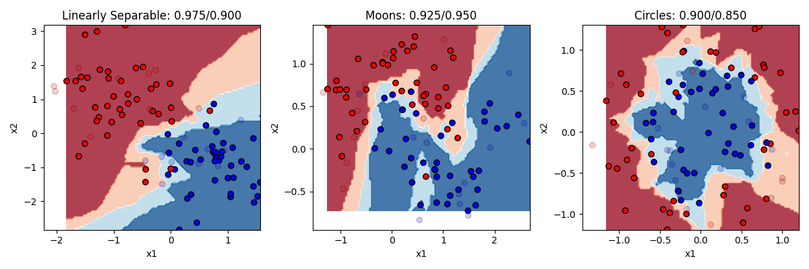
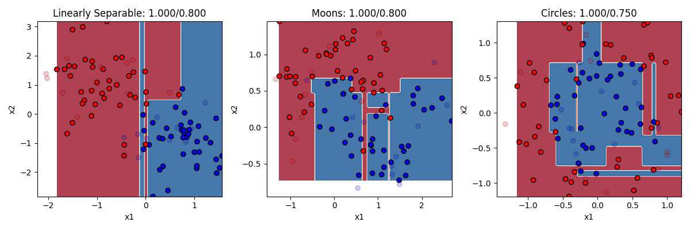

# Classification in sklearn

As we discussed in a previous section, we often want to predict categorical data. Which group does a 
particular observation belong to? There are many real world applications:
- classifying emails or text messages as spam or not spam
- classifying medical images as having a disease or not having a disease
- classifying images, such as identifying the content of images for autonomous vehicles or recognizing faces in photos.
- Object detection: In computer vision, supervised classification algorithms are used to detect objects in images and 
video streams.
- Speech recognition: determining what word was said by a person

There are also more specific applications within Brain and Cognitive Science
- Brain-computer interface: Supervised classification algorithms can be used to analyze EEG signals from the brain and 
control external devices like prosthetic limbs. 
- fMRI analysis: Supervised classification algorithms can be used to analyze fMRI data to identify brain regions that 
are activated during specific cognitive tasks, such as language processing, working memory, or attention. 
- Pattern recognition: Supervised classification algorithms can be used to identify patterns in brain activity that are 
associated with specific cognitive functions, such as learning, decision-making, or perception. 
- Diagnosis and treatment of neurological disorders: Supervised classification algorithms can be used to identify 
biomarkers in brain imaging data that are associated with neurological disorders such as Alzheimer's disease, 
Parkinson's disease, or schizophrenia. 
- Predicting cognitive performance: Supervised classification algorithms can be used to predict cognitive performance 
in individuals based on their brain imaging data, such as predicting working memory capacity or reaction time.

There are many algorithms you can use to do classification, and we are only going to very briefly survey a few here and 
show you how to use them in sklearn. But there are a couple of basic concepts to cover first. The main thing to have in 
mind when thinking about classification is that we have a bunch of observed data points where we know the features
of those observations, and also the category to which they belong. So for example, we might have the spectrogram of a 
bunch of people saying the word "dog" and also a bunch of people saying "log", and we want to learn a set of parameters
that allows us to distinguish between the two, and then use those parameters to make predictions on new data.

## Generating Some Data
As a general rule, you can think of classification as involving a feature space, and trying to learn the boundaries in 
that space that separate the categories. Let's generate some data to make this clear. Sklearn has some really nice 
built-in functions for generating fake datasets with certain properties that can be used to test classification 
problems. Let's look at the output first, and then go through the code that made them:


In the figure above, each of the three datasets has items that have a y value of either 0 or 1, establishing that they 
are either in the red or blue category. Each item also has a value for two predictor features (x1 and x2).

In the first dataset on the left, the category membership is predictable by a linear combination of x1 and x2. If an 
item is high on x1 and low on x2, that makes it more likely to be blue. But the relationship is not perfect. That's like 
the "noise" in our earlier examples.

In the second dataset in the middle, the data is generated by a function making a little "moon"  or u shape. The red 
items form an upside-down u on the top, and the blue items a right-side-up u on the bottom. But again the relationship 
is not perfect.

In the third dataset on the right, the data is generated by making two circles, with the blue one on the inside and the 
red one on the outside. But again the relationship is not perfect, and the circles overlap a little bit.

Here is the code that generated the data.
```python
from sklearn import datasets

random_seed = 404  # generate all datasets with this random seed. means result will be same every time we run code

dataset_list = []  # a list for our datasets

# generates a 
x, y = datasets.make_classification(n_samples=100, 
                                    n_features=2,  # how many dimensions to generate
                                    n_informative=2, #  how many of the features will matter
                                    n_redundant=0, # how many of the features will be redundant
                                    n_classes=2,  # how many categories there will be
                                    class_sep=0.8, # how much the categories will overlap
                                    n_clusters_per_class=1, # if and how many subgroups there will be
                                    random_state=random_seed)

dataset_list.append((x, y))

x, y = datasets.make_moons(n_samples=100, 
                           noise=0.3,  # how much the moons overlap
                           random_state=random_seed)

dataset_list.append((x, y))

x, y = datasets.make_circles(n_samples=100, 
                             noise=0.2,   # how much the circles overlap
                             factor=0.5,  # the size ratio of the inner to outer circle
                             random_state=random_seed)

dataset_list.append((x, y))
```
And here is the code that generated the figure, if you are interested.
```python
import matplotlib.pyplot as plt
from matplotlib.colors import ListedColormap

dataset_names = ["Linearly Separable", "Moons", "Circles"]
cm_bright = ListedColormap(["#FF0000", "#0000FF"])
fig, axes = plt.subplots(nrows=1, ncols=3, figsize=(12, 4))
for i, (x, y) in enumerate(dataset_list):
    ax = axes[i] # Select the subplot for this dataset
    ax.scatter(x[:, 0], x[:, 1], c=y, cmap=cm_bright, edgecolors="k") # Plot the points in the dataset

    # Set the title and axis labels for the subplot
    ax.set_title(f"{dataset_names[i]}")
    ax.set_xlabel("x1")
    ax.set_ylabel("x2")

plt.tight_layout()  # Adjust the layout of the subplots
plt.show()
```

## Overfitting and  Cross Validation
Before we go any further, we must introduce a very critical topic for machine learning, and that is the idea of 
overfitting. Overfitting is what happens we have an algorithm that learns parameters that perfectly match the data that 
you have seen, in a way that may lead the model to actually perform poorly at classifying new items because the 
algorithm was fitting the noise in the data, rather than just the rules that were generating the structure.

Consider our datasets again:


You can think of the classification problem as trying to draw a boundary (or set of boundaries) that gets all the red 
points on one side of the boundary, and all the blue points on the other side of the boundary. In the left example,
we could draw a single line through the space and do a pretty good, but not perfect, job at that. A few points would be
on the wrong side, accuracy would maybe be about 90-95%.

Now imagine drawing a much more complicated set of lines in the space to more perfectly get all the red on one side and 
all the blue on the other. If you were precise enough, you could draw a perfect boundary and classify all items with 
100% accuracy. But is that what we would want? 

We know that these data were generated by an algorithm that said blue = +x1 + -x2. The fact that some points don't 
perfectly follow that rule is random noise. So we if have our model perfectly capture those points too, we are actually 
adding that noise to our model, in a way that might hurt our ability to predict new points that just follow the normal 
rules. Consider the blue point on middle right that is just above a red point. If we drew the boundary to get that blue 
point right, depending on how we did it, we may end up making a bunch of that space in the top right "blue" space.
That would mean that if our model was used to classify new points up there, it would consider them blue, when in reality
we know they really should be red.

Having a model fit your training data too well, in a way that is capturing noise rather than capturing signal, is what 
is meant by `over-fitting` a model. How do we keep from over-fitting a model? There are a couple of principles to follow. 

The first principle is to not use a more complex model when a simpler one will do. This can mean don't use more features 
than you need. It can also mean using a simpler model type, out of the ones we discuss below. For some problems you need
a complex model. But the more complex the model, the more you are at risk of over-fitting.

The second way you can guard against over-fitting is by doing what is called`cross-validation`. Cross validation is when 
we test our model on a dataset other than the one we trained it on, to make sure that performance is not significantly 
worse. If it is, there is a good chance we have over-fit our model. in practice, we do not often have a second dataset.
But as a partial solution what we can do is split our dataset up, train the model on part of it, and then test on the 
other part.

When we train models on our datasets below, we will do this by splitting up our dataset, training it, and then testing 
it on the remainder. On to the models!


## Logistic Regression
The kind of classification model, logistic regression, we have already discussed a bit. The way logistic regression 
works is to really think about it as a transformation of simple logistic regression into the nonlinear sigmoid shape we 
discussed in the earlier section. Remember the sigmoid function looks like this:


Anytime the input (x) is between negative infinity and about -4, y stays very close to zero. But at -4 it starts to 
rise exponentially, getting to 0.5 when x=0, and continuing to rise quickly until x=4 when it flattens out again at 1.
This is nice, this means that we can have a predictor variable that varies continuously from really negative to really 
positive, and have that translate into saying either "yes" or "no" (1 or 0) in response to changes in that input.

So how can we use that like we did for linear regression? And what are the "parameters" like slope and intercept that
can tell us about the relationship between the predictor and outcome? And what do we do if we want to have multiple 
predictors? The great thing about the logistic function is that it's actually using the same linear function 
`y = b0 + b1x1 + ...` we were using before. That's the first step is to compute the linear version, and then use that 
output as the input into the logistic function, like this:
```text
z = b0 + b1*x1 + b2*x2 + ... bn*xn
y = 1 / (1 + e^(-z))
```
So you can think of all the different predictors (x1, x2, ...) as each being a different feature giving us information 
about whether the item should be in the category (output=1) or not in the category(output=0). We weight each feature 
by its parameter, (b1, b2, ...) which tells us how strongly and in what direction that gives us information about the 
item's category membership, and add up all these weighted values. That's z. Then we put z into the logistic function.
If the information in z is really biased in the positive direction, we will end up with a score of 1. If the information 
is really biased in the negative direction, we will end up with a score of 0. If the information in z balances out and 
is close to 0, then we will end up with a score of 0.5 (meaning we aren't sure if it's in the category or not.)

So hopefully what should be clear from this explanation is that logistic regression, even though it is "nonlinear" 
regression, is still linear in the sense that it is determining a score (z) for each input and using that score to 
make a prediction. This score is a linearly weighted combination of the different input features. This means that 
logistic regression will generate a single line in the feature space as its decision boundary.

Let's take a look a at how it does on our three datasets, then we will go through the code:

In this figure, direct your attention to a couple of things. First, notice that some points are lighter in color now. 
This is to visually display which point are in our training set (the darker 80% of the points) and which are in our test 
set (the more transparent 20%). Second, you can obviously see the background color here has been changed. This is 
showing the decision boundary our model is using, after it was trained on the training data. The darkness of the 
boundary shows where the points lie on the sigmoid curve. Right in the middle white area is where y = 0.5, the dark blue 
is where the model's prediction would be 1 and the dark red where the prediction would be 0.

In our model on the left, the model is indeed pretty accurate (93% on training items and 90% on test items). We can see 
that it is drawing a boundary that is roughly diagonal through the space (meaning it probably has pretty equal values 
for b1 and b2, though one will be negative and the other positive). The single, simple linear boundary works pretty well
here, since a linear boundary really was what was used to generate the data. Performance on the test items is only 
slightly worse.

In the other two models, the logistic regression does worse. Of course, you cannot correctly solve the circle or the 
moon problem with a simple line boundary. A line does ok on moons, and is actually worse than random guessing on the 
circles.

This demonstrates logistic regression's strengths and weaknesses. It works very well, and is a very simple model that is 
unlikely to overfit the data (training and test accuracy are about the same). But it can only solve problems that are 
linearly separable. And unfortunatly not many problems we deal with are that simple.

Let's look at the code. I've combined the code that makes the models and the figures:
```python
from sklearn.model_selection import train_test_split
from sklearn.linear_model import LogisticRegression
from sklearn.inspection import DecisionBoundaryDisplay
import matplotlib.pyplot as plt
from matplotlib.colors import ListedColormap

dataset_names = ["Linearly Separable", "Moons", "Circles"]  # labels for our subplots
cm = plt.cm.RdBu  # the color palette for the background
cm_bright = ListedColormap(["#FF0000", "#0000FF"])  # the colors for the dots
fig, axes = plt.subplots(nrows=1, ncols=3, figsize=(12, 4))  # create the subplot figure

for i in range(len(dataset_list)):
	x = dataset_list[i][0]
	y = dataset_list[i][1]
	x_train, x_test, y_train, y_test = train_test_split(x, y, test_size=0.2)

	classifier = LogisticRegression()
	classifier.fit(x_train, y_train)

	#y_pred = lr.predict(x_test)
	train_accuracy = classifier.score(x_train, y_train)
	test_accuracy = classifier.score(x_test, y_test)

	ax = axes[i]
	DecisionBoundaryDisplay.from_estimator(classifier, x_train, cmap=cm, alpha=0.8, ax=ax, eps=0.001)
	ax.scatter(x_train[:, 0], x_train[:, 1], c=y_train, cmap=cm_bright, edgecolors="k")
	ax.scatter(x_test[:, 0], x_test[:, 1], c=y_test, alpha=0.2, cmap=cm_bright, edgecolors="k")

	# Set the title and axis labels for the subplot
	ax.set_title(f"{dataset_names[i]}: {train_accuracy:.3f}/{test_accuracy:.3f}")
	ax.set_xlabel("x1")
	ax.set_ylabel("x2")

plt.tight_layout() # Adjust the layout of the subplots
plt.show() # Display the plot
```
As you can see above, logistic regression is just as easy as linear regression. We have this important line:
```python
x_train, x_test, y_train, y_test = train_test_split(x, y, test_size=0.2)
```
That splits our data randomly into a training set and test set with 20% of the data in the test set. Then we just create 
and fit the model. 

This line:
```python
DecisionBoundaryDisplay.from_estimator(lr, x_train, cmap=cm, alpha=0.8, ax=ax, eps=0.001)
```
is the special built in line from sklearn that draws those nice backgrounds where the boundary is. You give it your 
model and training set as a parameter, and it adds the color coded background to the figure.

## Neural Networks
A neural network is in some ways just a fancy logistic regression, but with what is called a "hidden layer". Let's 
take a look at graphical depiction of the two:


On the left is a graphical depiction of logistic regression with two predictor variables. We have parameters (b0, b1, 
and b2) that in the neural network context, we call `weights`. We compute the value of y as a function of the dot 
product of the input vector [x0=1, x1, x2] and our weight vector [b0, b1, b2]. The output unit (y) has what is called 
an `activation function`. If that activation function is `linear`, then y = dot(x, b), which is just regular linear 
regression. If the activation function is a 'sigmoid', then we have logistic regression. So a regression and neural 
networks with a single layer, like those on the left, are really the same thing.

But neural networks can also be made into `deep` neural networks with `hidden layers`. In this case, we have a layer of
units in between the input layer and output layer. What is this hidden layer doing? Let's think about the single layer 
network for a minute. In that network, the output y must be some linear combination of its inputs x1 and x2. But there 
is no way for it to represent a more complex function or curve. Hidden units effectively allow you to look for 
interactions among the inputs. So h1 could actually actually represent some complex nonlinear relationship between 
x1 and x2; h2 could represent a different nonlinear relationship between x1 and x2, and y could then represent a complex 
nonlinear relationship between h1 and h2.

That sounds vague. What does it mean in practical terms? In practical terms remember that logistic regression was limited 
to drawing a single linear boundary in the space. A hidden layer allows us to draw multiple boundaries in the space. Each 
hidden unit allows us to draw a new line, and then y can be a function of the combination of those lines. This means we 
can draw a much more complex boundary through the space. Let's see it in action. Below are three different models, 
one with 2 hidden units, one with 4 hidden units, and one with 32 hidden units.


Remember the rule about neural networks' hidden units: the number of hidden units is the number of lines you can 
draw making your boundary (with no hidden layer being 1 line). So we 2 lines at our disposal, we can 
end up with a curve on the linearly separable data. But remember this only needed a line, so this is actually 
overfitting a bit, and we can see our test accuracy drops from our training accuracy a bit. Two lines doesnt help 
much with the moons. Two lines helps a bit with the circles. Much better than chance now.

As we go to four hidden units we see more complex boundaries being draw in some cases. Four lines helps 
us draw something like a circle around the circle items, getting most of them right now. What happens when we go to 
32? Overfitting on at least the problems. It is drawing a very complex boundary to capture the training 
items, and that leads to some big mistakes in the circle case.

The takeaway is that neural networks can allow you to solve more complex problems than simple regression, 
but at the cost of really raising the chance of overfitting if you don't know how many hidden units you need 
to fit your data. If you work a lot with neural networks you can get better at figuring out the right number to use.

Let's look at the code. It's almost identical to our code before. We just need to import that model, and then 
change the line that created the logistic regression model to this:
```python
from sklearn.neural_network import MLPClassifier

classifier = MLPClassifier(hidden_layer_sizes=(32), 
                           activation='tanh', 
                           solver='adam', 
                           max_iter=5000000, 
                           learning_rate_init=0.01)
```
Everything else stays the same. We specify our number of hidden units, our hidden unit activation 
function, learning parameters (solver, learning rate, and number of iterations). For some problems, 
you need to play around with these parameters some.

## K Nearest Neighbors
K-Nearest neighbors is another algorithm that is conceptually very simple. It basically takes each 
point you are trying to classify, and looks for its k nearest neighbors (where you get to choose the 
value of k) and makes a decision based on them. If k is three, and 2 of the 3 nearest neighbors are 
blue and 1 is read, then it will guess blue. Majority rules!

Here's the code, just import the model and change the classifier line:
```python
from sklearn.neighbors import KNeighborsClassifier

classifier = KNeighborsClassifier(n_neighbors=3)
```
Let's see how it does with 3 and with 20 nearest neighbors



KNN does pretty well. KNN is actually a really good algorithm in that it is really neutral about what is 
generating the data, it just looks at the neighbors instead of trying to come up with a formula to explain 
everything. The downside to KNN is that in order to figure out what the K nearest neighbors are, it has to 
calculate the distance between each point in the dataset. In our small toy dataset that's no big deal. But 
if you have bigger datasets with lots of features, then it can be computationally very slow.

## Decision Trees and Random Forests
Description coming soon. But here's the code:
```python
from sklearn.tree import DecisionTreeClassifier
from sklearn.ensemble import RandomForestClassifier
classifier = DecisionTreeClassifier()
classifier = RandomForestClassifier(n_estimators=100)
```



## Naive Bayes
Description coming soon. But here's the code:
```python
from sklearn.naive_bayes import GaussianNB
classifier = GaussianNB()
```


Next: [11.5. Clustering in sklearn](../CH11/11.5.%20Clustering%20in%20sklearn.md)<br>
Previous: [11.3 Regression in sklearn](../CH11/11.3.%20Regression%20in%20sklearn.md)
