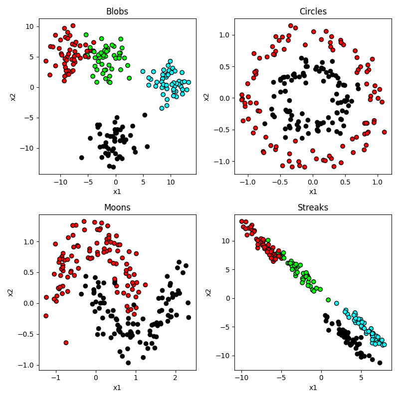
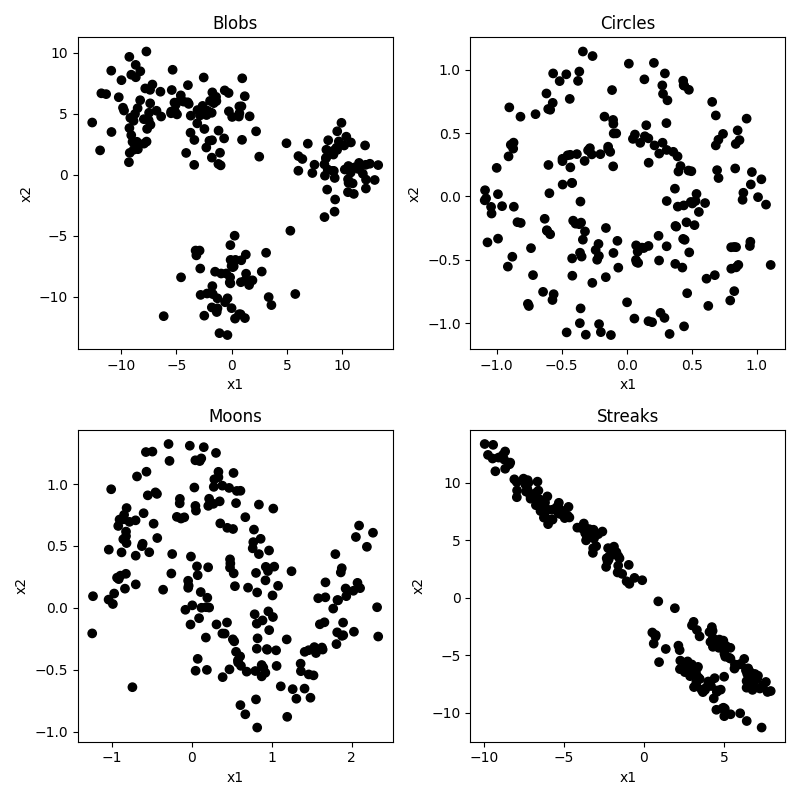
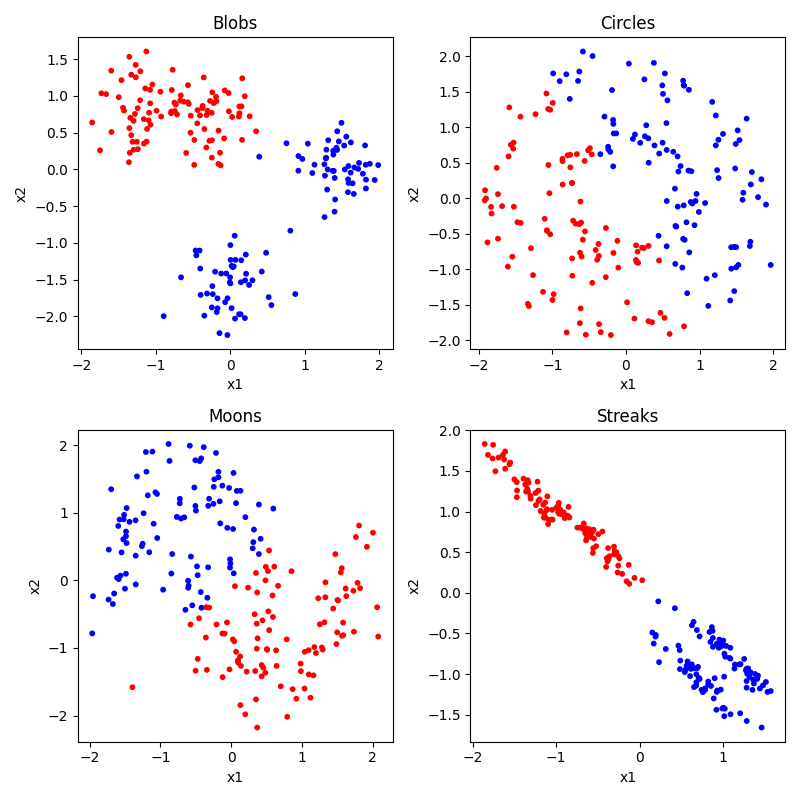
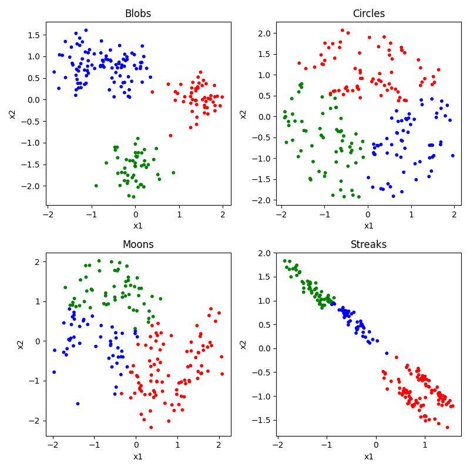
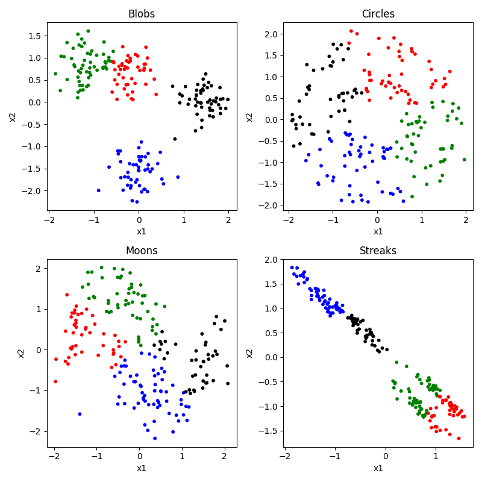
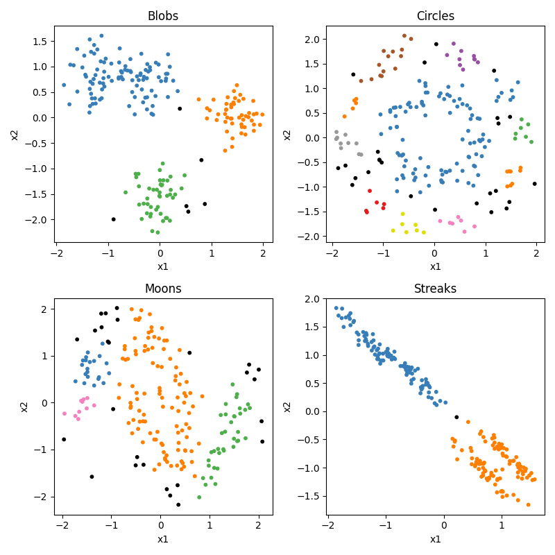
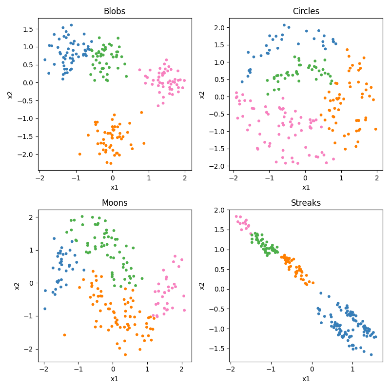
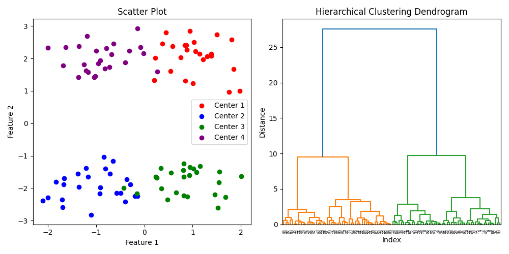

# 11.5. Clustering

Now we are going to cover some unsupervised machine learning techniques. Remember that supervised learning is when 
we are truing to make a model that makes predictions about values or categories, based on labeled data where we 
already know the right answer or relationship between our variables. In contrast, in unsupervised learning, we are just 
trying to notice structure in our data to help us understand it better, but without knowing (or even trying to find) a
"right answer."

## Datasets 
As before, let's start off making some toy datasets that show off the properties of our data. This time we are going 
to make six datasets.
- blobs: some blobs that are mostly linearly separable (except for the noise)
- circles: like before, circles embedded inside each other
- moons: same as the last section
- streaks: some streaks that are like stretched out blobs
```python
from sklearn import cluster, datasets, mixture
import numpy as np
import matplotlib.pyplot as plt
from matplotlib.colors import ListedColormap

n_samples = 200
n_classes = 4
blobs = datasets.make_blobs(n_samples=n_samples, centers=n_classes, cluster_std=2)
circles = datasets.make_circles(n_samples=n_samples, factor=0.5, noise=0.1)
moons = datasets.make_moons(n_samples=n_samples, noise=0.2)
streaks = (np.dot(blobs[0], [[0.6, -0.6], [-0.4, 0.8]]), blobs[1])
dataset_list = [blobs, circles, moons, streaks]
dataset_names = ["Blobs", "Circles", "Moons", "Streaks"]
dataset_position = [(0,0), (0,1), (1,0), (1,1)]

fig, axes = plt.subplots(nrows=2, ncols=2, figsize=(8, 8))
cm_bright = ListedColormap(["#FF0000", "#0000FF", "#00FF00", "#FFFF00"])

for i, (x, y) in enumerate(dataset_list):
	ax = axes[dataset_position[i]]
	x = dataset_list[i][0]
	y = dataset_list[i][1]

	ax.scatter(x[:,0], x[:,1], c=y, cmap=cm_bright, edgecolors="k")
	ax.set_title(f"{dataset_names[i]}")
	ax.set_xlabel("x1")
	ax.set_ylabel("x2")

plt.tight_layout() 
plt.show()
```
output


So you can see that our circles and moons have two categories used to generate the data. Our blobs are in four 
distinct-looking groups, although the red and green ones overlap slightly. The 'streaks' dataset takes those blobs and
smears them out in a diagonal direction. Conceptually these groups look just as distinct, but as you will see this 
creates a problem for some algorithms and not others.

But of course, the whole point in this "unsupervised" section is that we don't know any of the right answers, we are 
just inspecting the data to see what clusters we can find. So in our current situation, the data actually looks like 
this:



Not so easy to tell all those clusters apart now. Certainly the blobs and streaks look like two groups, not three. You 
can really see how having those color codes made those green and red blobs look distinct, but in reality not so much. 
That's confirmation bias at work. It's hard to look at the circles and moons without still seeing them. But how much 
of that is because you know they are circles and moons? We will see that some clustering algorithms have real difficulty
with these categories.

## Use Cases for Unsupervised Clustering
There are many common use cases for unsupervised clustering. 

The first is observation segmentation: Unsupervised clustering can be used to group observations with similar behaviors,
features, preferences, or demographics together. In brain and cognitive science we might use this to group together 
participants, stimuli, brain regions, or behavioral responses that tend to go together in some way. In the business 
world, this might be used to group customers with similar behaviors, preferences, or demographics together for targeted 
marketing, personalized recommendations, or better customer service. For example, a company may use clustering to 
identify different types of shoppers based on their purchasing history, website activity, or social media interactions.

A second use case is image and text categorization. Unsupervised clustering can be used to group similar images or 
documents together based on their visual or textual features, for tasks such as image retrieval, content recommendation, 
or topic modeling. For example, a search engine may use clustering to group images of animals or landscapes together, 
or a news website may use clustering to group articles on similar topics. This can be used for targeted marketing, 
personalized recommendations, or better customer service. For example, a company may use clustering to identify 
different types of shoppers based on their purchasing history, website activity, or social media interactions.

A third use case is anomaly detection. Unsupervised clustering can be used to identify unusual or anomalous objects that 
deviate from the normal patterns or distributions of the data. This can be useful for detecting unusual behaviors in an 
experiment, or brain regions that are behaving very differently from other regions. In the business world, this can be 
used to detect fraud, intrusion, or other security breaches in financial, network, or medical systems. For example, a 
credit card company may use clustering to identify unusual spending patterns or locations that may indicate fraudulent 
activity.

A fourth use case is feature engineering. Unsupervised clustering can be used to identify important or relevant features 
or dimensions of the data that can be used for further analysis or modeling. This can be useful for reducing the 
dimensionality of high-dimensional data, identifying subgroups or patterns in the data, or generating new features or 
representations of the data. For example, a biologist may use clustering to identify genes or proteins that are 
co-expressed or co-regulated together in a particular tissue or condition.

There are many clustering algorithms. As with classification, they have their pros and cons depending on the structure 
of the data you are working with. Let's take a look at some popular ones. But first we need to do one more thing.

## Normalizing the data
A common first step before doing machine learning analyses is to `normalize` the data. This means that you are putting 
each predictor feature dimension on the same scale. Some dimensions may be higher variance than others, and that might 
mean those dimensions are getting more weight. What we do is first `z-score` each dimension (subracting the mean of each 
from dimension from each x value, and then dividing by the standard deviation. To do this we need to import the 
StandardScalar function form sklearn, and then call that function on our x data before we plot it or use it in a 
clustering algorithm.
```python
from sklearn.preprocessing import StandardScaler
x = StandardScaler().fit_transform(x)
```

It doesn't make too much of a difference in our case because our data was generated randomly with equal standard 
deviations used for each feature or cluster. But in a real world setting this step is critical. But you can see that 
the scale of our axes have changed, now going from -2 to 2 with a center at 0. We are now looking at each observation's
x1 and x2 score relative to the mean, and scaled by the standard deviation (i.e. a score of +2 means  that x value 
was 2 standard deviations higher than the mean). And if you look really closely you can find other differences. In our 
original dataset, the range of the x1 and x2 axes were not always quite identical, whereas after normalization this 
gets evened out a bit, making each dimension count more equally.

## KMeans Clustering
Kmeans is a conceptually very simple algorithm. You specify ahead of time how many groups or centers (K) you are looking 
for. It then tries to place those K points at places that minimizes the total distance of each observation to at least 
one of the K means, and then uses the closest mean to choose each observation's cluster. Let's see how it does. Of 
course, before we can do that, we would need to specify our number of clusters ahead of time. We'll look at 2, 3, and 4.
```python
fig, axes = plt.subplots(nrows=2, ncols=2, figsize=(8, 8))
colors = ["red", "blue", "green", "black"]

for i in range(len(dataset_list)):
    
    # get the current dataset's info
	ax = axes[dataset_position[i]]
	x = dataset_list[i][0]
	y = dataset_list[i][1]
    
	x = StandardScaler().fit_transform(x)  # normalize the data
    
    # run the clustering algorithm
	clustering_alg = cluster.MiniBatchKMeans(n_clusters=4, n_init="auto")
	clustering_alg.fit(x)
    
    # get the predicted labels for each observation
	if hasattr(clustering_alg, "labels_"):
		y_pred = clustering_alg.labels_.astype(int)
	else:
		y_pred = clustering_alg.predict(X)
        
    # create a list of colors for each observation based on its predicted category.
    # the first line creates a list of colors equal to the number of different clusters identified by the algorthm
    # then black is added as the last color
    # then color_list assigns a color to each observation based on its category prediction
    colors = np.array(list(islice(cycle(
    ["#377eb8","#ff7f00","#4daf4a","#f781bf","#a65628","#984ea3","#999999","#e41a1c","#dede00",]),
        int(max(y_pred) + 1),)))
    colors = np.append(colors, ["#000000"])  # add black at the end of the list
	color_list = [colors[i] for i in y_pred]
    
    # plot the data
	ax.scatter(x[:, 0], x[:, 1], s=10, color=color_list)

	# Set the title and axis labels for the subplot
	ax.set_title(f"{dataset_names[i]}")
	ax.set_xlabel("x1")
	ax.set_ylabel("x2")

plt.tight_layout()  # Adjust the layout of the subplots
plt.show()
```
Here is the result for 2 Clusters. Sensible guesses, but we can see it is making some mistakes compared to the 
process that generated the data. The two that actually have two groups (moons, circles) are not very accurate.



Here is the result for 3 Clusters. Bad as we would expect for moons and circles. The results for blobs and streaks 
are interesting. In both cases in groups two of the clusters together, but differently. In the blobs case, it can't 
distinguish the two in the top left. In the streaks case it kind of separates those (though not perfectly) and groups 
the two in the bottom right.



Here is the result for 4 Clusters. Again bad for moons and circles. Gets the blobs mostly right, but still really messes
up the streaks. Because the streaks create so much variance along the streak from top left to bottom right, the 
difference between the two streaks is actually less than the difference within each streak, so it creates means that 
split them up incorrectly.



To summarize, K-means clustering is a widely used unsupervised learning technique for clustering data into groups. It 
has several advantages and disadvantages:

### Advantages:
- K-means is relatively easy to understand and implement, and it can be applied to a wide range of data types and 
structures.
- It is computationally efficient and can handle large datasets with many variables and observations.
- K-means is a simple and robust method that can handle noisy or incomplete data, and it can be used to preprocess 
data for further analysis or visualization.
- K-means provides a natural and interpretable way to divide data into clusters based on the similarity of the data 
points, and it can be used for data exploration, pattern recognition, and prediction.

### Disadvantages:
- K-means requires the user to specify the number of clusters, which can be challenging or subjective in practice.
- The clustering results can be sensitive to the initial conditions (how it randomly selects its trial mean points) and 
the choice of distance metric, and the algorithm may converge to a suboptimal solution.
- K-means assumes that the clusters are spherical and have equal variance, which may not be true for all datasets.
- K-means may not work well for datasets with overlapping or irregularly shaped clusters, or for datasets with widely 
varying densities or scales.
- K-means does not handle categorical or ordinal data well, and it may produce different results for different data 
scales or normalization methods.

Despite its limitations, K-means is a widely used and effective clustering technique that can be useful in many 
applications. It is often used as a baseline or benchmark method for comparing other clustering algorithms, and it can 
be extended or modified to overcome some of its limitations.

## DBSCAN Clustering
DBSCAN (Density-Based Spatial Clustering of Applications with Noise) is a popular clustering method that groups data 
points based on their local density. In other words, it notices places were a lot of points are near each other but 
then separated by empty spaces, and calls those clusters. One nice thing about DBSCAN is that it doesn't need to be told
the number of clusters, it figures it out from the data.

To use DBSCAN, just swap out the model lines in the code above:
```python
clustering_alg = cluster.DBSCAN(eps=0.3)
```
Output:


So we can see that DBSCAN appears to do ok, but not great. But the trick with DBSCAN is that it really relies on that 
`eps` parameter. What is eps? Eps is how sensitive the algorithm is being to the density, i.e., how close does it 
require points to be to group them together. At its maximum (1.0) it doesnt care how big the relative gap is, it just 
groups everything together into one big group. At its minimum, it treats every point as a different cluster. So with 
many datasets you can get good or bad performance with different settings, depending on the relative density of the 
clusters.

### Advantages:
- DBSCAN can handle datasets with arbitrary shapes and sizes of clusters, and it does not require the user to specify the 
number of clusters beforehand.
- DBSCAN can identify noise points, which do not belong to any cluster, and it can handle outliers effectively.
- DBSCAN is computationally efficient and can handle large datasets with many variables and observations.
- DBSCAN is a robust method that is less sensitive to the initial conditions and the choice of distance metric compared 
to other clustering methods.
- DBSCAN can be used for a wide range of data types and structures, including non-numerical data and mixed-type data.

### Disadvantages:
- DBSCAN requires tuning of the two parameters: epsilon (the radius of the neighborhood around each point) and minPts 
(the minimum number of points in the neighborhood required to form a dense region). Choosing these parameters can be 
challenging, especially for high-dimensional or sparse data.
- DBSCAN can have difficulty handling datasets with varying density or with clusters of different sizes and densities.
- DBSCAN may not be able to find clusters in datasets with low-density regions or with noise that is spread throughout 
the data.
- DBSCAN can be sensitive to the choice of distance metric and may require data preprocessing or normalization.

## Spectral Clustering
Spectral clustering is a clustering method that takes the original x matrix and performs `singular 
value decomposition` (or SVD) on it. This is basically a way to reduce the dimensionality of the data, and or to replot 
the data in way that better organizes the variance in the dataset.

In our 2D dataset, imagine that could redraw the two axes in any orientation, with the stipulation that they must stay 
perpendicular. You can, in addition, then stretch or squeeze the data along the new dimensions. Take our streak data and 
imagine drawing a diagonal axis that divided the top left from the bottom right, and then a perpendicular axis that 
divided the top right from the bottom left. But then also imagine that you could pull on the top right corner and the 
bottom left corner, stretch out the data along that axis. That would make some streaks pull away from each other
and be less likely to be grouped together.

How it works:
- Construct a similarity matrix that measures the similarity between each pair of data points. This can be done using a 
distance metric such as Euclidean distance or a kernel function such as Gaussian kernel.
- Compute the eigenvalues and eigenvectors of the similarity matrix using singular value decomposition (SVD).
- Project the data points onto the eigenvectors to obtain a lower-dimensional representation of the data.
- Apply a clustering algorithm, such as k-means, to the lower-dimensional representation to group the data points into 
clusters.

So as you can see, spectral clustering is actually something you do in addition to one of the other approaches. So let's
try it with kmeans. Here's the code to do it with four clusters:
```python
clustering_alg = cluster.SpectralClustering(n_clusters=4, 
                                            eigen_solver="arpack", 
                                            affinity="nearest_neighbors",)
```
output:


So it does the blobs well, but kmeans alone did too. It's still not good at the circles. It does do something 
interesting with the moons. It doesn't get them right, but it gets them half right. Each half moon is in a different 
category. Here is where the clustering could be useful, it could help you see that there are moons there once it shows 
them to you spit in half.

### Advantages:
- Spectral clustering can handle datasets with non-linear or non-convex shapes and can capture complex structures in the 
data.
- Spectral clustering can handle datasets with varying density or with clusters of different sizes and densities.
- Spectral clustering can handle high-dimensional data and can reduce the dimensionality of the data to improve the 
clustering performance.
- Spectral clustering is less sensitive to the initial conditions and the choice of distance metric compared to other 
clustering methods.
- Spectral clustering can be used for a wide range of data types and structures, including non-numerical data and 
mixed-type data.

### Disadvantages:
- Spectral clustering requires the user to choose the number of clusters, which can be challenging or subjective in 
practice.
- Spectral clustering can be computationally expensive and memory-intensive, especially for large datasets.
- Spectral clustering can be sensitive to the choice of distance metric, kernel function, or other hyperparameters.
- Spectral clustering may not be able to handle noisy or outlier data points effectively, and it may require data 
preprocessing or normalization.

Despite its limitations, spectral clustering is a popular and effective clustering method that can be useful in many
applications. It is often used as a baseline or benchmark method for comparing other clustering algorithms, and it can 
be extended or modified to overcome some of its limitations.

## Hierarchical Clustering
The last approach we want to show you is a bit different. It's called hierarchical clustering.

Hierarchical clustering is a clustering algorithm that groups similar data points into nested clusters by recursively 
merging or splitting clusters. It creates a hierarchy of clusters that can be visualized as a tree-like diagram, called 
a dendrogram. Hierarchical clustering can be either agglomerative, where each data point starts in its own cluster and 
pairs of clusters are merged in a bottom-up fashion, or divisive, where all data points start in one cluster and 
clusters are recursively split in a top-down fashion.

Here is the code. We are going to generate a different dataset here, just with the blobs, to make a point about how it 
works:
```python
from sklearn.datasets import make_blobs
from scipy.cluster.hierarchy import dendrogram, linkage
import matplotlib.pyplot as plt

# Generate example dataset
# the centers is what allows us to create blobs that have have sub-clusters within the blobs.
# the numbers specify where the blob centers should be.
centers = [(.5, 2), (-.5, -2), (.5, -2), (-.5, 2)]
X, y = make_blobs(n_samples=200, centers=centers, cluster_std=1, n_features=2)

# Perform hierarchical clustering
Z = linkage(X, method='ward')

# Create figure with two subplots
fig, (ax1, ax2) = plt.subplots(1, 2, figsize=(10, 5))

# Plot scatter plot on the left subplot
colors = ['red', 'blue', 'green', 'purple']
for i, center in enumerate(centers):
    X_center = X[y == i]
    ax1.scatter(X_center[:, 0], X_center[:, 1], c=colors[i], label=f'Center {i+1}')
ax1.legend()
ax1.set_title('Scatter Plot')
ax1.set_xlabel('Feature 1')
ax1.set_ylabel('Feature 2')

# Plot dendrogram on the right subplot
dendrogram(Z, ax=ax2)
ax2.set_title('Hierarchical Clustering Dendrogram')
ax2.set_xlabel('Index')
ax2.set_ylabel('Distance')

plt.tight_layout()
plt.show()
```
Output:


Overall, hierarchical clustering is a powerful tool for clustering analysis that provides a flexible and interpretable 
approach to grouping similar data points. However, its computational complexity and sensitivity to noise and outliers 
can be limitations in certain applications.

### Advantages
- Flexibility: Hierarchical clustering can be used with different distance metrics and linkage criteria, allowing it to 
handle a wide range of data types and structures.
- Interpretability: The dendrogram generated by hierarchical clustering provides a visual representation of the 
hierarchical structure of the clusters, which can be used to interpret the relationships between the data points.
- No assumption of the number of clusters: Hierarchical clustering does not require specifying the number of clusters in 
advance, which can be advantageous when the number of clusters is not known a priori.

### Disadvantages
- Computational complexity: The time and memory requirements of hierarchical clustering can be significant, especially 
for large datasets.
- Lack of scalability: Hierarchical clustering may not scale well to very large datasets, or datasets with high 
dimensionality, due to the computational complexity of the algorithm.
- Sensitivity to noise and outliers: Hierarchical clustering can be sensitive to noise and outliers, which can affect 
the quality of the resulting clusters.
- Lack of flexibility in merging and splitting: The agglomerative and divisive nature of hierarchical clustering may not 
be appropriate for all data structures, and may not allow for the discovery of complex cluster structures.

Next: [11.6. Lab 11](../CH11/11.6.%20Lab%2011.md)<br>
Previous: [11.4 Classification in sklearn](../CH11/11.4.%20Classification%20in%20sklearn.md)
