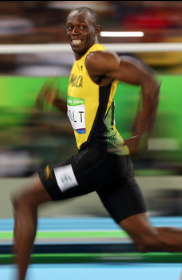

# 11.6. Lab 11

1) Create a program with a main function that is called. Create a class called `Display` that has an attribute `root`
that creates a tkinter window. Create an instance of Display in the main function called `my_display`, and call 
my_display.mainloop() so the window doesn't close.

2) Create a method in Display called `init_window()` that is called from `Display`'s init method. Have that method:
   - rename the window "Runner"
   - use a class attribute called `screen_size`, set to (800,600), to configure the size of the tkinter window
   - creates two frames in the window, one called "runner_frame" and one called "interface_frame". Use .grid() to 
   position the interface frame at the bottom. Make that frame 100 pixels tall, and the runner frame the remainder 
   (700). But code this using the screen_size variable, not by hard-coding 700. This way if the screen size is changed, 
   the frames will stay the correct size.

3) Create a method called `create_interface_frame` that:
    - creates a "Quit" button that terminates the application when it is clicked
    - creates a "Go!" button that calls a method called "go()" when it is clicked (we will create that later)
    - add the buttons to the interface frame
    - Change the appearance of the buttons (size, shape, color, etc.) and arrange these buttons in the interface frame 
   in a manner of your choosing.

4) Create a method called `create_runner_frame` that:
   - creates a canvas called action_canvas and adds it to the runner_frame
   - make sure the action canvas occupies the entirety of the frame.
   - Centered and at the top of the canvas, add some text that says "Here is a runner. Click the 'Go!' button to make 
   them run."
   - Change the font size, type, and color to a choice of your liking.
   - save the image shown below, and use tkinter to draw the image to the canvas, centered and below the text.
   

5) Create a method called `go()` that is activated by pressing the "Go!" button. Make this method:
   - Make the image move horizontally 500 times, each time by 10 pixels. But, if the runner gets to either edge of the 
   screen, have the image start moving in the other direction.

6) Add a slider widget to the interface frame that can be used to change the speed of the runner. when the slider is at 
   the far left end, have the runner move 1 pixel every time it moves. When the slider is at the far right, have the 
   runner move 10 pixes every time it moves. Add a text label widget above the slider that says "Runner Speed". Add the 
   two widgets to the interface frame.

Next: 12.0. Games and Simulations 
Previous: [11.5. Other Tkinter Methods](11.5.%20Other%20Tkinter%20Methods.md)
