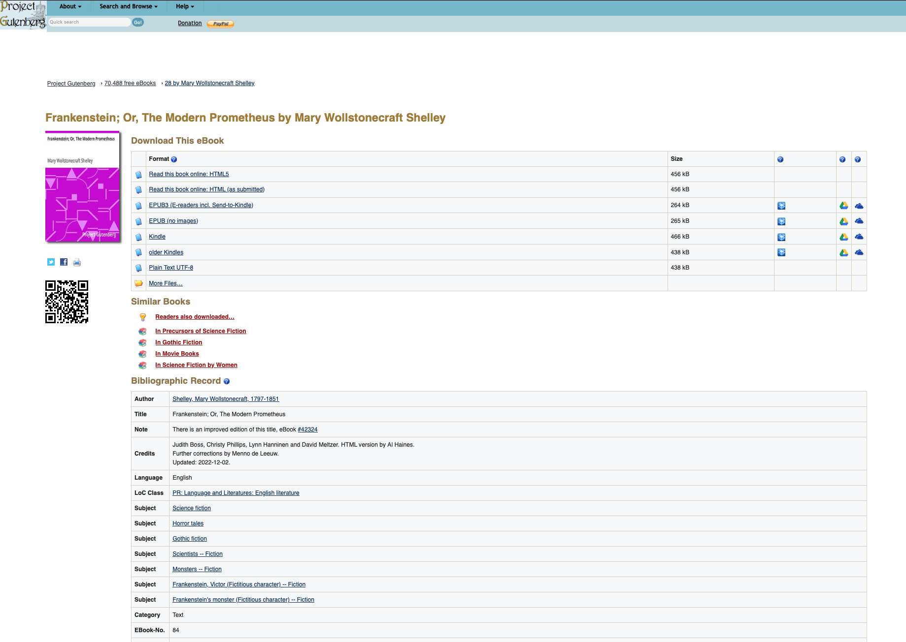

# Homework 5

### Prepare the project directory
Create a directory called HW5. Put in it a "texts" directory and an "src" directory.

### Download two books from the project gutenberg website using python
Project gutenberg is a website that hosts free ebooks for many classic books. We're going to use it to analyze
and compare two books.

In the src directory, make a python script called "download_novels.py". In that script, insert this code:
```python
import requests
import os

def download_gutenberg_book(book_id):
    # Construct the URL for the book
    url = f"http://www.gutenberg.org/files/{book_id}/{book_id}-0.txt"
    
    # Send a request to the URL
    response = requests.get(url)
    
    # Check if the request was successful
    if response.status_code == 200:
        # Get the book title from the response headers

        title = f"book_{book_id}"
        
        
        # Write the book contents to a new file in the directory
        filename = os.path.join("..", "texts", f"{title}.txt")
        with open(filename, "wb") as f:
            f.write(response.content)
        
        print(f"Downloaded {title} ({book_id}) to {filename}.")
    else:
        print(f"Failed to download book {book_id}.")

book_id_list = [98, 105]
for book_id in book_id_list:
    download_gutenberg_book(book_id)
```

Next, go to the Project Gutenberg website and choose two books to add to the book_id_list. Each book on 
project gutenberg has a page like this:


Each book has a unique id number. Frankenstein, for example in the image, is EBook-No. 84. Get the numbers and 
add them to your list. Run the script and you should get the two books downloaded into your "tests" directory.

### Do a sentiment analysis of both books.
Next we want to see which of the books is more positive or negative in its polarity, and how that changes over
the course of the book, and how it varies by different subjects in the book . In src, create a script called "analyze_books.py".
Paste in the following code, and then complete as described:

```python
import os
import spacy
import re
import textblob
import pandas as pd
import numpy as np
import matplotlib.pyplot as plt

def load_text_strings(path):
	'''
	this function should create a return a list of strings for each text stored in the path variable
	it shold also create a list of the names of each text, using the filename
	if your filenames are not the actual names of the books, you can manually change them
	'''
	text_string_list = []
	text_name_list = []
	return text_string_list, text_name_list

def clean_text_string(text_string):
	'''
		this function should take a single text string and clean it and return the cleaned version.
		clean it by doing the following
		- strip any spaces at the beginning or end of the string
		- lowercase the string
		- replace the hidden character "\ufeff" (this is an encoding character in 
			project gutenberg texts) with an empty string """
		- replace all line breaks "\n" with spaces
		- use a regular expression to find any cases of 2 or more spaces, and replace iwth a single space.
			make sure you do this last one after the previous one, so that the previous doesnt result in
			two spaces being next to each other.
	'''
	return text_string

def get_spacy_doc(text_string):
	'''
		this function should take a text string as input and return a spacy document as an output
	'''
	print(f"    Tokenizing")
	doc = None
	return doc

def get_sentence_string_list(doc):
	'''
		this function should take a spacy doc as input and return a list of sentences from the doc, 
		as strings (not spacy docs)
	'''
	sentence_string_list = []
	return sentence_string_list

def get_sentence_subject_list(doc):
	print(f"    Getting Subjects")

	'''
		this function should take a space doc as input and return a list of subjects of each sentence
		in the doc
	'''
	sentence_subject_list = []
	return sentence_subject_list

def get_sentence_index_list(sentence_string_list, num_bins):
	'''
		this function should take a list of sentence strings and an int num_bins as input, and return two lists:
		- sentence_index_list: a unique number for each sentence in the list
		- a "bin" number that is computed by dividing the list of sentences into num_bins different bins, and 
			listing which bin each sentence is in. For example, if there were 20 sentences, and the number of bins
			was 4, then the list should be [0,0,0,0,0,1,1,1,1,1,2,2,2,2,2,3,3,3,3,3].
	'''
	sentence_index_list = []
	sentence_bin_list = []

	return sentence_index_list, sentence_bin_list

def get_polarity_score_list(sentence_list):
	'''
		this function should take a list of sentence strings as inputs and use textblob to return a list of 
		polarity scores for each sentence
	'''
	print(f"    Getting Polarity Scores")
	polarity_list = []
	return polarity_list

def get_text_title_list(text_title, n):
	'''
		this function should take the text title and an integer n, and return a list of the text title repeated n
		times
	'''
	title_list = []
	return title_list

def mean_polarity_by_bin(df):
	'''
		this function should take the main df as input, and return a dataframe giving summary statistics of polarity
		for each bin of each text. So if you have two novels and 10 bins per novel, you should end up with a df with 
		20 rows and the following columns: [index, text_title, bin, polarity_mean, polarity_stderr, polarity_count]
		polarity_stderr = polarity_std / (polarity_count**0.5)
	'''
	mean_polarity_by_bin_df = None
	return mean_polarity_by_bin_df

def plot_mean_polarity(mean_polarity_by_bin_df):

	'''
		this function should create a line plot with one line for each novel, and the mean polarity at each bin
		as the points in each line, and the stderr for each bin as error bars at each point. Make sure to label 
		the axes and figure
	'''
	pass

def get_subject_polarity_df(df, n):
	'''
	this function should get us the mean and other summary statistics of the polarity for each sentence 
	subject in each novel, after removing pronouns. Then reduce the dataframe to only the n most frequent
	sentence subjects

	create the dataframe below that
		- takes the full dataframe as an input
		- filters out rows where the subject is a pronoun in the list below
		- computes the summary statistics of each sentence's subject's polarity, grouped by text_title
		- keep only the resulting rows with the n highest scores for count for each novel
		- in other words, if n=3, and you have 2 novels, you should end up with a df with 6 rows and the following columns:
			[index, text_title, sentence_subject, polarity_mean, polarity_stderr, polarity_count]
			polarity_stderr = polarity_std/(polarity_count**0.5)
	'''
	mean_subject_polarity_df = None
	pronoun_list = ["he", "she", "it", "you", "i", "we", "they", "one", "these", "this", "that"]
	return mean_subject_polarity_df

def plot_subject_polarity(mean_subject_polarity_df):
	'''
	Create a figure with k subplots, one for each novel (but dont hardcode 2, make it work with an unfixed number). I would suggest 1 column with k rows.
	Each subplot should be a bar plot of the average polarity of the sentence subjects in that novel. Error bars should be the standard error, i.e. the std/sqrt(count)
	make sure to label the figure, subplots, and axes.
	'''
	pass

def main():
	path = "../texts"  # the path to the saved text files
	test = True  # if we are currently testing the code
	test_size = 50000   # the number of characters from the text to use as our test
	num_bins = 10  # how many bins to split the book into
	num_subjects = 5   # the number of subjects to plot

	text_string_list, text_title_list = load_text_strings(path)  # loading our texts into a list of strings, and a list of titles

	df_list = []  # an empty list to store our dataframes in (one for each text)

	# loop through our list of texts
	for i in range(len(text_title_list)): 
		text_string = text_string_list[i]
		text_title = text_title_list[i]
		print(f"\nProcessing {text_title}\n" + 40*"*")

		if test:  # shrink the text to test_size number of characters, for testing purposes
			text_string = text_string[:test_size]

		cleaned_text_string = clean_text_string(text_string)  # get a cleaned version of the string
		doc = get_spacy_doc(cleaned_text_string)  # get a spacy document from the string
		sentence_string_list = get_sentence_string_list(doc)  # get a list of the sentences for the text, as a string
		sentence_subject_list = get_sentence_subject_list(doc)  # get lists of sentences subjects
		polarity_list = get_polarity_score_list(sentence_string_list)  # get list of polarity scores for each sentence
		text_titles = get_text_title_list(text_title, len(sentence_string_list))  # get a list of repetitions of the text title, equal to len(sentence_string_list
		sentence_index_list, sentence_bin_list = get_sentence_index_list(sentence_string_list, num_bins)  # get a list of index numbers for each sentence in the text

		# test to make sure all lists are the same size
		#print(len(doc), len(sentence_string_list), len(sentence_subject_list), len(subject_is_named_entity_list), len(sentiment_list), len(text_titles), len(sentence_index_list))

		# create a dataframe with the data
		new_df = pd.DataFrame({"text_title": text_titles,
							   "sentence_index": sentence_index_list,
							   "sentence_bin": sentence_bin_list,
							   "sentence_subject": sentence_subject_list,
							   "polarity": polarity_list
							   })
		df_list.append(new_df)
		print()

	df = None  # replace this line with the one below when your list of dataframes is correct
	#df = pd.concat(df_list, ignore_index=True).reset_index()  # concatenate our list of dataframes for each text into one big one

	mean_polarity_by_bin_df = mean_polarity_by_bin(df)  # compute the mean polarity per bin of each book
	plot_mean_polarity(mean_polarity_by_bin_df)  # plot the polarity by bin
	mean_subject_polarity_df = get_subject_polarity_df(df, num_subjects)  # 
	plot_subject_polarity(mean_subject_polarity_df)
```
