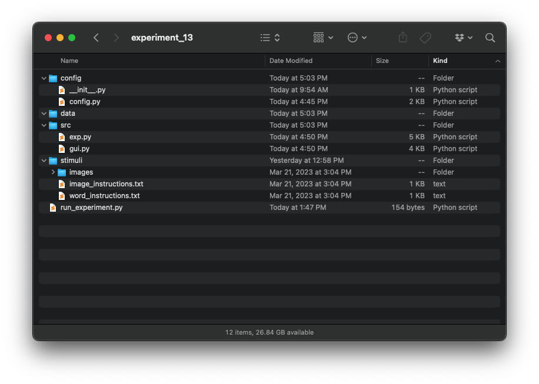

# 13.2. Creating Our Experiment Project

In this and the following sections we are going to create the experiment. Follow along with the instructions below, 
creating the files and code as described. When done, you should have a working experiment!

The first thing we need to do when creating an experiment is create a directory structure for all the stuff in our 
experiment. We are going to have code for running the experiment and for its graphical user interface. We are also going 
to have stimuli to store (images), and data files to keep track of. Your really need to keep all this organized. So the 
first thing we are going to do is create a directory structure with some folders and basic files. We want a top level 
folder called `experiment_13`. Inside that folder we want to create four sub-folders:

- `src`, where we will put most of our code
- `stimuli`, where we will put our images
- `data`, where we will put our data files
- `config`, where we will put some text files containing variables our program will use

### Experiment Stimuli

Our experiment will present participants with a sequence of either pictures or words, and so we will need some pictures.
You can get them from our ebook data/ directory, in CH11/images.zip. Download that fill, and unzip the file into your 
stimuli folder. You should then end up with an images folder inside your stimuli folder.

### Instruction Stimuli

Continuing with our theme of making the code as generalizeable and changeable as possible, let's think about how we 
want to store the text of the instructions we will give to the participants. We could create a variable in the code 
that saves the instructions as a string. But that would mean we are really mixing the code of our experiment with the 
specific details from this experiment. A better approach is to save the instructions in a text file. That way if we 
later want to change the instructions, or the experiment, the two are independent and we don't need to worry about 
changes to one affecting the other. So let's create two text files our stimuli folder, called `word_instructions.txt` 
and `image_instructions.txt`. These two files will be the instructions we will show to participants depending on whether 
they are being showed words or images. Inside those files put the following text:

word_instructions.txt
```text
In this experiment you are going to be shown a sequence of words, one at a time. After seeing the entire sequence, there will be a brief delay. Then you will be give a memory test. In the memory test, you will again see a second sequence of words one at a time. For each word, you will decide if it was a word you saw during the first sequence. If you saw the word previously, you will indicate the answer is "yes" by pressing the "j" key. If you did NOT see the word previously, you will indicate the answer is "no" by pressing the "k" key. When you are ready to begin seeing the list of words, press the SPACE BAR.
You have completed the list. Now after a short delay you will have a memory test. You will again see a sequence of words. If you saw the word in the previous list, press the "j" key. If you did NOT see the word in the previous list, press the "k" key. Please rest your right hand on the keyboard on the "j" and "k" keys. Please try to respond as quickly and as accurately as you can.
READY
SET
GO!
You have completed the experiment. Thank you for your participation. Please press the SPACE BAR to quit.
```

image_instructions.txt
```text
In this experiment you are going to be shown a sequence of pictures, one at a time. After seeing the entire sequence, there will be a brief delay. Then you will be give a memory test. In the memory test, you will again see a second sequence of pictures one at a time. For each picture, you will decide if it was a picture you saw during the first sequence. If you saw the picture previously, you will indicate the answer is "yes" by pressing the "j" key. If you did NOT see the picture previously, you will indicate the answer is "no" by pressing the "k" key. When you are ready to begin seeing the list of pictures, press the SPACE BAR.
You have completed the list. Now after a short delay you will have a memory test. You will again see a sequence of images. If you saw the image in the previous list, press the "j" key. If you did NOT see the word in the previous list, press the "k" key. Please rest your right hand on the keyboard on the "j" and "k" keys. Please try to respond as quickly and as accurately as you can.
READY
SET
GO!
You have completed the experiment. Thank you for your participation. Please press the SPACE BAR to quit.
```

Note a couple fo things about content of these files. Each file has 6 lines; the lines will correspond to different 
instructions that will appear on the screen at different times. This way we can store the instructions in a list, and 
then just reference the position in the list when we want to show that set of instructions. For this reason, it is 
important that there are no extra line breaks in the file, separating the different sentences that we want to appear 
on the screen at the same time, even though this makes the lines harder to read because you have to scroll to see them 
all.

Let's look more closely at the six lines. The first line gives general instructions that tell someone what will happen 
during the experiment. This line will display at the very beginning of the experiment. The second line tells them they 
have finished the first (familiarization) list, and now are going to be tested for their memory of that list. They will 
say whether they saw the item by pressing the "j" key if they think was in the previous list (an "old" stimulus) or the 
"k" key if they think it was not in the previous list (a "new" stimulus). The next three lines are the words: ready, set, 
go, which will appear one at a time to really make sure they are ready to respond as quickly and as accurately as they 
can. Finally the last line tells them they are done with the experiment.


### Program Scripts
The final thing we need to do is create the scripts where the actual python code will live. This program is going to 
contain five python script files (though only four will actually have any code in them). The main script will be called 
`run_experiment.py`, and will be at the top level of the `experiment_13` directory. Inside the `src` directory, we want 
to create two additional script files, one called `exp.py` and one called `gui.py`. Finally, we want to create two 
scripts inside the `config` folder. The first will be called `config.py`, and the second will be called `__init__.py`. 
Note that that is the word "init" with two underscores on each side. Naming it exactly like this is very important, for 
reasons I will explain in the next section. 

For now, just create the five empty files with those names, and we will fill in their content in later sections. When 
you are done, you should have a directory that looks like this:


Next: [13.3. Creating the Experiment Class](13.3.%20Creating%20the%20Experiment.md)<br>
Previous: [13.1. Describing a Sample Experiment](13.1.%20Describing%20a%20Sample%20Experiment.md)