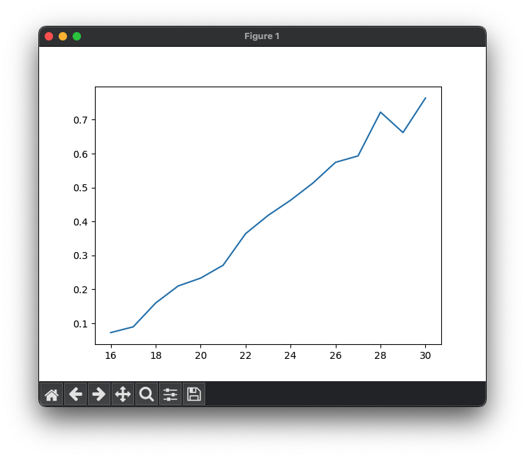
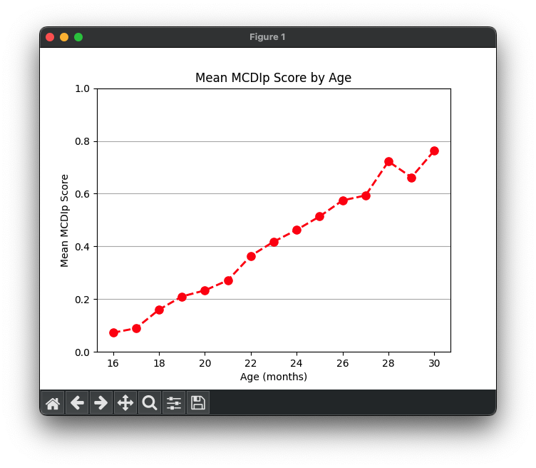
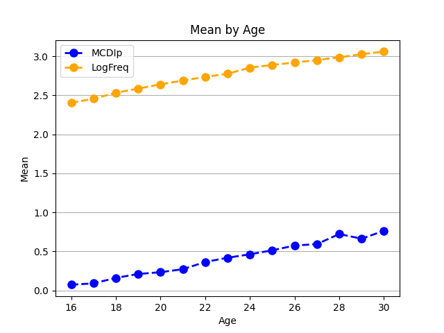

# 15.1. Simple Line Plots
The simplest way to create a line plot is just to call the plt.plot() function, and pass it in a list of x-coordinates, 
and a list of y-coordinates, and it will draw the line plot.

Let's combine that with our new pandas skills to create a plot of the average MCDIp score from our dataset. Remember, 
the MCDIp score for each word is the percentage of children at a given age who say that word. So here, we are going to 
compute the average MCDIp score across all 500 words at each age. 

So first we use a pandas statement to create a new dataframe that has that data, using the groupby() function and 
telling it we want the mean() of MCDIp.
```python
# calculate the mean frequency for each age group
mean_mcdip_by_age = mcdi_df.groupby('Age')['MCDIp'].mean()
print(mean_mcdip_by_age)
```
Print Output:
```text
Age
16    0.072588
17    0.089531
18    0.159805
19    0.210012
20    0.233139
21    0.271172
22    0.364170
23    0.417908
24    0.462604
25    0.513568
26    0.574354
27    0.593179
28    0.722286
29    0.662010
30    0.763803
Name: MCDIp, dtype: float64
```
You can see this gives us a data frame with only one column of data (the mean MCDIp score). It uses the groupby() 
variable (in this case, age) as the index column. We can now use those two columns as our x and y variables to create a 
line plot. You can pass a matplotlib plot any iterable sequence of numbers, a list, an array, or a set. But the easiest 
thing to do is just to pass it a column from a pandas dataframe. You can do this by just typing the name of the 
dataframe followed by a period, followed by the column name. IN this case, our column names are "index" and "values" 
because our dataframe was a single column of data with an index.
```python
# create scatter plot
plt.plot(mean_mcdip_by_age.index, mean_mcdip_by_age.values)
plt.show()
```
Output:\


The plot connects the data points with lines, visualizing the relationship between age and mean word frequency. And 
while this is a nice first effort, the plot is quite bare. It violates the first rule of making science graphs: LABEL 
YOUR AXES!.

Luckily we can add labels for each axis to improve the readability. Some options, like those specifying the color, 
thickness, and style of the line, and whether the line has markers at our data points, can be specified when you create 
the line. Other properties, like those labeling the axes and the figure itself, must be set separately.

```python
plt.plot(mean_mcdip_by_age.index, mean_mcdip_by_age.values,
         color='red', linestyle='--', linewidth=2, marker='o', markersize=8)

# add labels and a title
plt.xlabel('Age (months)') # label the x axis
plt.ylabel('Mean MCDIp Score') # label the y axis
plt.ylim(0, 1) # force the y-axis to be from 0 to 1
plt.title('Mean MCDIp Score by Age') # give the figure a title
plt.grid(True, axis='y') # # add horizontal gridlines

# show the plot
plt.show()
```
Output:\


We can create a line plot that has more than one line. First, let's create a new data frame that gets us the average
at different ages of two of our variables.
```python
cols = ['MCDIp', 'LogFreq']
mean_df = mcdi_df.groupby('Age')[cols].mean()
mean_df = mean_df.reset_index() # insert a new numbered index into the new dataframe
print(mean_df)
```
output:
```text
    Age     MCDIp   LogFreq
0    16  0.072588  2.403829
1    17  0.089531  2.455150
2    18  0.159805  2.532085
3    19  0.210012  2.585922
4    20  0.233139  2.639456
5    21  0.271172  2.688775
6    22  0.364170  2.735728
7    23  0.417908  2.775869
8    24  0.462604  2.853728
9    25  0.513568  2.888611
10   26  0.574354  2.919528
```
You can see that we created a list of the columns we wanted to keep, and used that list as the input input the groupby
statement.

Now we can use a for loop to add each column in our "columns" list as a line in the plot:
```python
columns = ['MCDIp', 'LogFreq']
mean_df = mcdi_df.groupby('Age')[columns].mean()
mean_df = mean_df.reset_index() # insert a new numbered index into the new dataframe

# Loop through the word statistics and plot each one
colors = ['blue', 'orange']
num_cols = len(columns)
for i in range(num_cols):
    plt.plot(mean_df['Age'], mean_df[columns[i]], 
             label=columns[i], color=colors[i], linestyle='--', linewidth=2, marker='o', markersize=8)

# add labels and a title
plt.xlabel('Age')
plt.ylabel('Mean')
plt.title('Mean by Age')

plt.legend() # add a legend
plt.grid(True, axis='y') # add horizontal grid lines

plt.show() # show the plot

```
Output:\

We can see, not surprisingly, that the cumulative frequency of a word (how many times it has occurred in speech to 
children) goes up over time, as does the percentage of children who say each word.

Want to customize your line plots even more? Check out the documentation page here: https://matplotlib.org/stable/api/_as_gen/matplotlib.pyplot.plot.html

Next: [15.2. Scatter plots and Histograms](15.2.%20Scatterplots%20and%20Histograms.md)<br>
Previous: [15.0. Data Visualization](../CH15/15.0.%20Data%20Visualization.md)