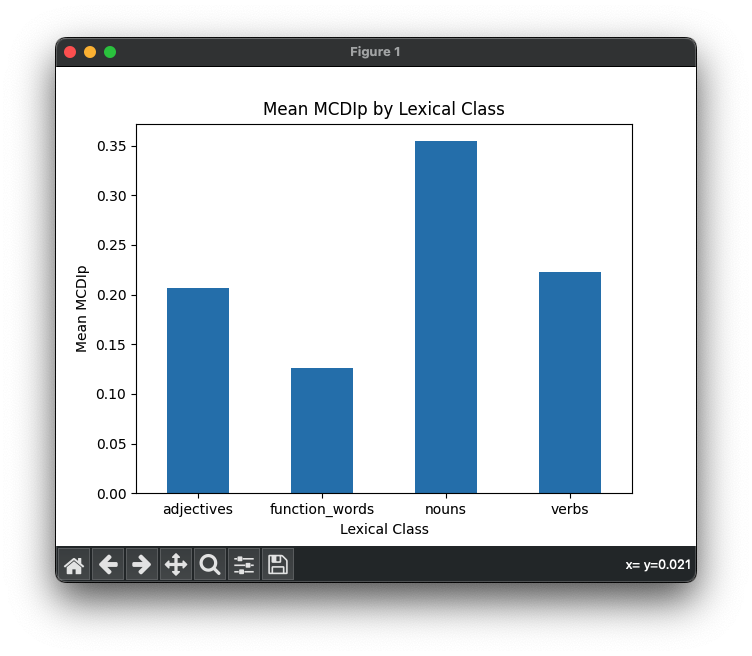

# 15.3. Bar Plots

Bar plots are useful for visualizing and comparing categorical data. Let's start by creating another subset of our data:
the data for only 21 month-olds, and averaging MCDIp separately for each grammatical class at that age.

```python
mcdi_21_df = mcdi_df.query('Age == 21')
stats_by_class = mcdi_21_df.groupby('Lexical_Class')['MCDIp'].mean()
print(stats_by_class)
```
output:
```text
Lexical_Class
adjectives        0.207079
function_words    0.126022
nouns             0.354411
verbs             0.222982
Name: MCDIp, dtype: float64
```

```python
mcdi_df.plot.bar(x='Lexical_Class', y='MCDIp', rot=0)
plt.xlabel('Lexical Class')
plt.ylabel('Mean MCDIp')
plt.title('Mean MCDIp by Lexical Class at 21 months')
plt.show()
```
Output:\


We could make this graph look a little nicer, with some different colors and error bars. We calculate standard error 
bars (the standard deviation divided by the square root of the sample size) using another pandas groupby operation.
Note 
```python
import numpy as np
# Calculate the standard error and 95% confidence intervals for each lexical class
n_by_class = mcdi_df.groupby('Lexical_Class')['FQ'].count()
stderr_by_class = mcdi_df.groupby('Lexical_Class')['FQ'].std() / np.sqrt(n_by_class)

# Set custom colors
colors = ['blue', 'orange', 'green', 'red']

# Plot the bar chart with error bars
plt.bar(mean_freq_by_class.index, mean_freq_by_class.values, 
        yerr=stderr_by_class, color=colors, capsize=5, edgecolor='black')

# Add labels and a title
plt.xlabel('Lexical Class')
plt.ylabel('Mean Word Frequency')
plt.title('Mean Word Frequency by Lexical Class')

# Show the plot
plt.show()
```
Output:\


You can find additional information about bar plots and customization here: https://matplotlib.org/stable/api/_as_gen/matplotlib.pyplot.bar.html. 

Next: [15.4. SubPlot Figures](15.4.%20SubPlot%20Figures.md)<br>
Previous: [15.2. Scatter Plots and Histograms](15.2.%20Scatterplots%20and%20Histograms.md)
