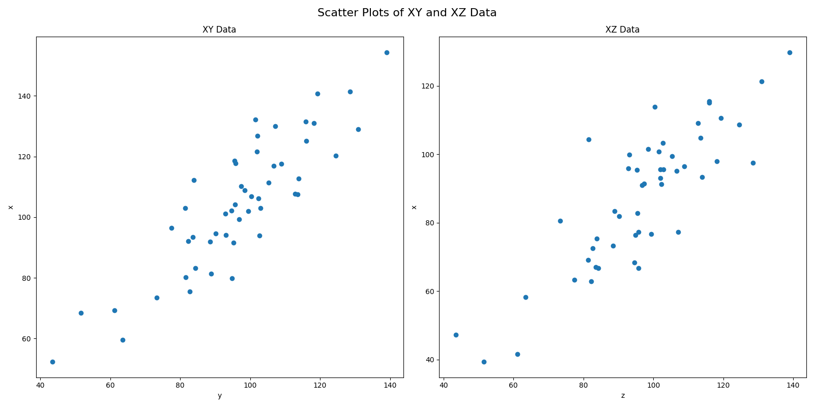
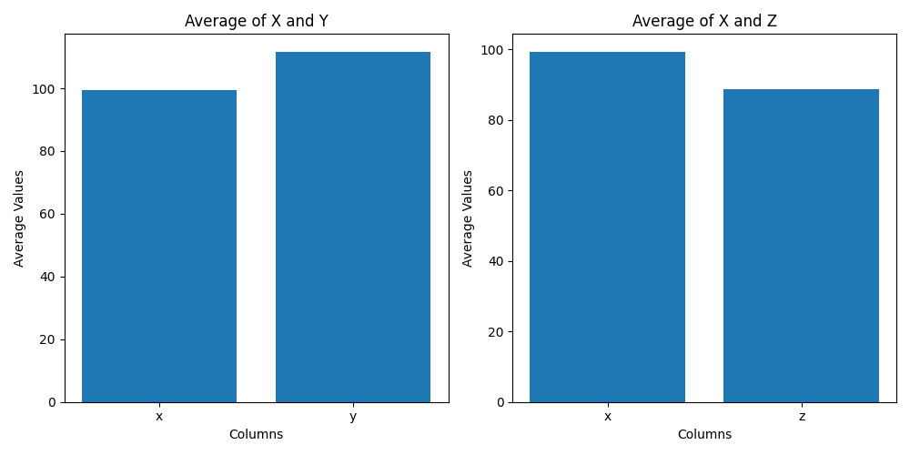
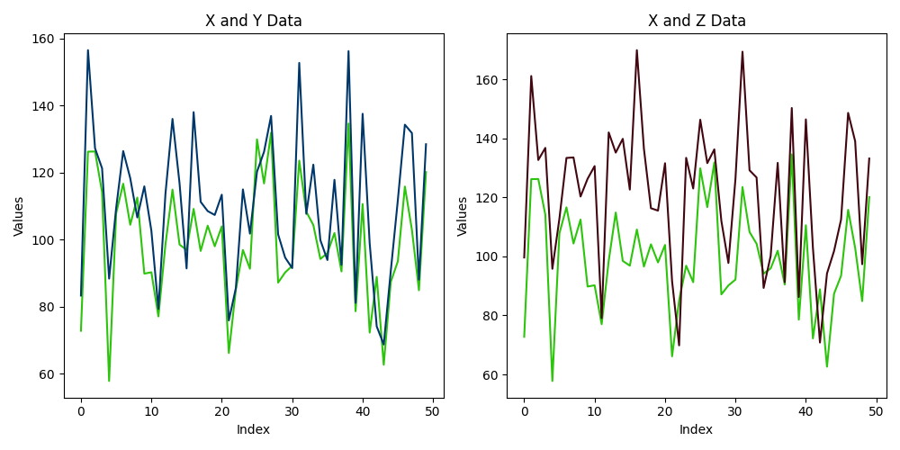

# 15.4 Subplot Figures

Now that we have talked about creating simple matplotlib plots, it's time to talk about creating more 
complex figures. In this section we'll go over three things: 1) additional ways you 
can customize your figures, and 2) how create figures with multiple plots in the same figure, and 3) how 
to save figures directly to a file. For the first two, we will introduce the  subplots() function, which is used to 
create multiple plots in a single figure.

## Multiple Plots on the Same Figure
To create a subplot figure in matplotlib, let's first generate some quick data to use as an example:
```python
import matplotlib.pyplot as plt
import pandas as pd
import numpy as np

x = np.random.normal(100, 20, 50)  # create a random array of 50 normally distributed numbers
y = x + np.random.normal(10, 10, 50)  # create a second array that will be correlated with the first one
df = pd.DataFrame({'x': x, 'y': y})  # turn those two arrays into a pandas dataframe
print(df.head(10))
```
Output:
```text
            x           y           z
0  105.213450  116.168283  111.586334
1   97.990982  101.872151  103.467505
2   83.265683  100.975598   72.601834
3   82.318511   93.203049   71.576572
4  109.210605   99.683663  100.408998
5   90.448397   99.732173   67.437949
6  127.604686  125.473239  124.816922
7  112.825203  129.001598   92.179598
8  121.061036  120.242041  121.455901
9  115.702167  133.936938  109.759181
```
Now let's create a scatterplot of X with Y, and another of X with Z, on the same figure. The first line 
creates the figure by specifying the number of rows and columns of subfigures you want (in our case, 1 row with 2 
columns), and how big you want to the figure to be, in inches. The function gives you back two variables: a figure 
object (containing the info about the overall figure), and an axs object, which is a matrix of "axes subfigures",
in other words, the subfigures themsevles, which you can access through indexing the same way you would a numpy 
array. So in our case, because our shape is [1,2], we can access the left subplot with [0] and the right subplot with 
[1]. When then use that on the next lines to create a scatterplot on each subplot (specifying the x and y data for 
each). Then we can modify properties of the subplots and figure itself.
```python
fig, axs = plt.subplots(1, 2, figsize=(16, 8))

axs[0].scatter(df['x'], df['y'])
axs[1].scatter(df['x'], df['z'])

axs[0].set_title('XY Data')
axs[0].set_xlabel("y")
axs[0].set_ylabel("x")

axs[1].set_title('XZ Data')
axs[1].set_xlabel("z")
axs[1].set_ylabel("x")

fig.suptitle("Scatter Plots of XY and XZ Data", fontsize=16)
fig.tight_layout()
plt.show()
```
Output:\


Here is an example with bar plots. It can be smart to name the resulting variables something more descriptive.
```python
bar_fig, bar_axs = plt.subplots(1, 2, figsize=(10, 5))

# create bar plot of averages of 'x' and 'y' columns
bar_axs[0].bar(['x', 'y'], [df['x'].mean(), df['y'].mean()])
bar_axs[0].set_title('Average of X and Y')
bar_axs[0].set_xlabel('Columns')
bar_axs[0].set_ylabel('Average Values')

# create bar plot of averages of 'x' and 'z' columns
bar_axs[1].bar(['x', 'z'], [df['x'].mean(), df['z'].mean()])
bar_axs[1].set_title('Average of X and Z')
bar_axs[1].set_xlabel('Columns')
bar_axs[1].set_ylabel('Average Values')

# adjust spacing between subplots
bar_fig.tight_layout()

# show the plot
plt.show()
```
Output:\


Here it is with line plots:
```python
line_fig, line_axs = plt.subplots(1, 2, figsize=(10, 5))

# plot x and y data on left subplot
line_axs[0].plot(df['x'], color='blue')
line_axs[0].plot(df['y'], color='orange')
line_axs[0].set_title('X and Y Data')
line_axs[0].set_xlabel('Index')
line_axs[0].set_ylabel('Values')

# plot x and z data on right subplot
line_axs[1].plot(df['x'], color='blue')
line_axs[1].plot(df['z'], color='grey')
line_axs[1].set_title('X and Z Data')
line_axs[1].set_xlabel('Index')
line_axs[1].set_ylabel('Values')

# adjust spacing between subplots
line_fig.tight_layout()

# show the plot
plt.show()
```
Output:\


## Saving your Figures.

After creating and customizing your visualizations, you may want to save them as image files to use in presentations,
reports, or other documents. Matplotlib provides a simple way to save your plots as various image formats, such as 
PNG, JPEG, SVG, and PDF, using the `savefig()` function. You can do this with both the simple plots, or also the 
more complex subplot figures.
```python
# Create a simple line plot
plt.plot(mean_freq_by_age.index, mean_freq_by_age.values)

# Add labels and a title
plt.xlabel('Age (months)')
plt.ylabel('Mean Word Frequency')
plt.title('Mean Word Frequency by Age')

plt.savefig('line_plot.png') # Save the plot as a PNG file
plt.savefig('line_plot_highres.png', dpi=300) # Save the plot as a high-resolution PNG file
plt.savefig('line_plot.pdf') # Save the plot as a PDF file
plt.savefig('line_plot.svg') # Save the plot as an SVG file

# Close the plot (optional, but useful if you are creating multiple plots in a loop)
plt.close()
```
Note at the bottom here is plt.close(). If you are creating multiple plots in the same code, this is a way to 
make matplotlib forget everything about the previous one before you start the next one. If you are creating simple 
plots and saving them, it is good habit to end with this so an option for one doesn't stay set when you create the 
next one. Alternatively, if you are creating subplot figures, and naming them separate things, this can be another 
way to keep this from happening.

Next: [15.5. Lab 15](15.5.%20Lab%2015.md)<br>
Previous: [15.3. Bar Plots](15.3.%20Bar%20Plots.md)
