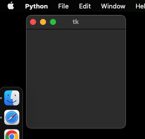
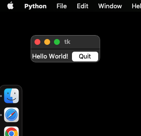

# 3.4. TKinter Applications

## Creating a Window 

To start, let's begin by just creating a basic application window. 

To do this, first we need to introduce the idea of a python module. A module in python is a set of extra code that is 
not active and available in python by default. Importing a module into python makes all of that code available to your 
program. To import a module, we just type *import* and then the name of the module (remember that case sensitivity 
matters). It is good programming practice to put all of your import statements at the very top of your python program. 

```python
import tkinter
root = tkinter.Tk()
root.mainloop()
```

The code should create a window that looks like this (although it may be white, depending on your OS settings):



In the second line, tkinter.TK() creates an instance of a tkinter window object. This needs to be assigned to a variable 
if we want to do anything with the window, so we assign it to a variable named "root". This is a common variable name 
that programmers use to refer to the main window in an application that may end up having many windows. The "root" 
window is the main window, and then many other windows may "belong" to that window in a hierarchical fashion.

The third line then accesses one of the methods of that window object, the .mainloop() method. This is basically just a 
command that keeps the window open until some action is taken to close it. If you don't use this line, you will see the
window blink into and out of existence really quickly. The mainloop() method is necessary if you are going to have your
application do anything.

Create a python program called tk_test.py, and try pasting these three lines into it, saving it, and running it. You
should have your first window!

Another quick thing to introduce here is the fact that when you import a module, you can rename it within your program
so that every time you access code from that module, you won't have to type it out the long way each time. In the 
example below, you can see that "as tk" is added to the first line, and that on the second line we then refer to tk 
instead of tkinter. We may end up calling tkinter many times in a program, and so this can save a lot of time. Most 
popular modules have standard ways of abbreviating their names in scripts, and the standard way of abbreviating Tkinter
is as tk.

```python
import tkinter as tk
root = tk.Tk()
root.mainloop()
```

## Tkinter Hello World Program

Now let's make the window a little more interesting, and create a "Hello World" program. The code below as the same 
three lines as our code above, except we have renamed "root" to "main_window" to make it more obvious this is the main 
window. We also insert three widgets:
- a frame, used to group the other two widgets
- a label, used to insert some text
- a button, used to create a quit button

```python
import tkinter as tk

main_window = tk.Tk()

main_frame = tk.Frame(main_window)
main_frame.grid()

hello_world_label = tk.Label(main_frame, text="Hello World!")
hello_world_label.grid(column=0, row=0)

quit_button = tk.Button(main_frame, text="Quit", command=main_window.destroy)
quit_button.grid(column=1, row=0)

main_window.mainloop()
```

The code above should create a window that looks like this:



Notice some details about the creation of each widget. Different kinds of widgets have different parameters you can 
set. The first parameter of each widget is what object that widget "belongs to", or is considered a part of. The 
frame widget's first argument is "main_window", so it belongs to the main window and is placed inside of it. The label 
and button widgets' first argument is main_frame, so those objects belong to the frame. This demonstrates an important 
concept of Tkinter, that objects have a hierarchical organization. This can be very useful for organizing applications.

After the first parameter, the other parameters differ for different widgets. Frame widgets don't need additional 
arguments (although there are some optional ones we'll discuss later). Labels have an argument called "text" where you
specify what text you want to appear. There are also other optional arguments (like font size and type) that we'll 
explore later. The button widget is using two of the optional parameters: *text* to specify what text appears on the 
button, and *command* to specify what function is called when the button is pushed. In this program, we tell Tkinter
to execute the .destroy() method of the main window object, which closes the window and exits the application.

Finally, notice that after each widget is created, we call the widget's .grid() method. The .grid() method is one of 
three methods we can use to decide where widget's parent object the widget should occur. The .grid() method arranges 
widgets using a grid-like row and column format. 

When we called the .grid() method on frame, no row and column is specified, and so tkinter assumes the default row and 
column of 0, meaning the frame is placed in the first row and first column (remember we start counting at 0) of its 
parent object, which in this case is main_window. Since there are no other objects placed in a grid in the main window, 
this cell takes up the full window. 

When we called the .grid() method on the label and button widgets, both had a row=0, indicating they both go in the 
first row of their parent (in this case, main_frame). The label widget is placed in the first column, and the button 
widget is placed in the second column.

## Key Tkinter Concepts

The example program above illustrates five key concepts of Tkinter (as described in the [Tkinter documentation](https://docs.python.org/3/library/tkinter))

### Widgets
A Tkinter user interface is made up of individual widgets. Each widget is represented as a Python object, 
instantiated from classes like tk.Frame, tk.Label, and tk.Button.

### Widget Hierarchy
Widgets are arranged in a hierarchy. The label and button were contained within a frame, which in 
turn was contained within the root window. When creating each child widget, its parent widget is passed as the first 
argument to the widget constructor.

### Configuration Options
Widgets have configuration options, which modify their appearance and behavior, such as the 
text to display in a label or button. Different classes of widgets will have different sets of options.

### Geometry Management
Widgets aren't automatically added to the user interface when they are created. A geometry manager like grid controls 
where in the user interface they are placed.

### Event Loop
Tkinter reacts to user input, changes from your program, and even refreshes the display only when actively running an 
event loop. If your program isn’t running the event loop, your user interface won’t update.


Next: [3.5. TKinter Widgets](3.5.%20TKinter%20Widgets.md)<br>
Previous: [3,3. Graphical User Interfaces](3.3.%20Graphical%20User%20Interfaces.md)