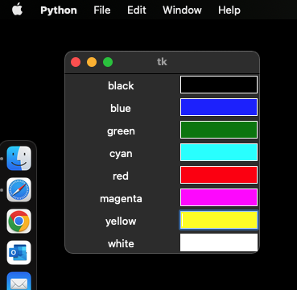
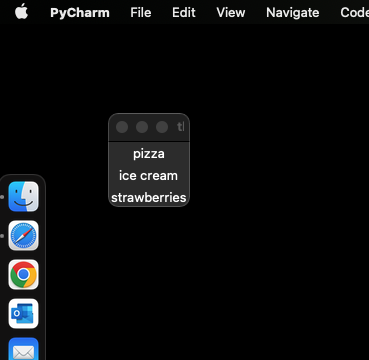
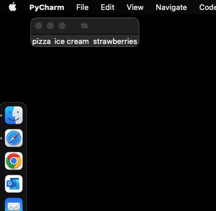
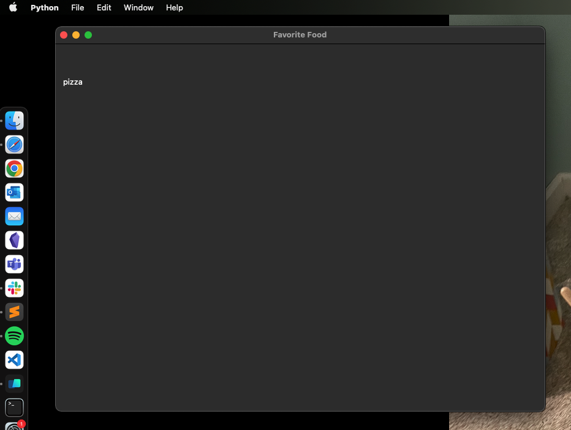

# 3.5. Tkinter Layout Management

As we mentioned, there are three ways to arrange widgets in a Tkinter window. We already briefly described .grid(), and
there is also .pack() and .place(). We will go over each in a little more detail here. 


## Grid

Grid is in many ways the easiest layout tool in Tkinter to use. It is easy to conceptualize a window in terms of
rows and columns and just put stuff in them. As long as your application's arrangement can be treated as a 
two-dimensional table, then grid is probably the best option. It's only limitation is if you want to more precisely 
organize things in exact locations. You can do this in grid by embedding frames within frames within frames, but it 
can get complicated. If you need that level of control then it is best to use place.

```python
import tkinter as tk

main_window = tk.Tk()

color_list = ['black', 'blue', 'green', 'cyan', 'red', 'magenta', 'yellow', 'white']

row_counter = 0
for color in color_list:
    new_label = tk.Label(main_window, text=color, width=15)
    new_label.grid(row=row_counter, column=0)
    
    new_entry = tk.Entry(bg=color, width=10)
    new_entry.grid(row=row_counter, column=1)
    
    row_counter += 1
    
main_window.mainloop()
```

The code above creates a window that looks like this (your window background color may be white):



The code above is another example of an important principle: our code can be simpler and better if you can use an 
algorithm to specify stuff instead of hard-coding it. The code above could have been hard-coded, with eight different 
creations of label widgets, gridding of those widgets, creation of new entry widgets, and gridding of those widgets. By
using a loop we were able to accomplish the same thing much more concisely.

Two other things to note about the above example. First is that if you want to apply colors in Tkinter (to text, 
graphics, or to the backgrounds of objects), you can do this by specifying color names. If you want to get more specific, 
you can specify colors using rgb (red-blue-green) color codes specified in hexidecimal codes following a pound sign. For 
more information about hex-based colors in Tkinter, see here: 
[https://www.tutorialspoint.com/how-to-use-rgb-color-codes-in-tkinter](https://www.tutorialspoint.com/how-to-use-rgb-color-codes-in-tkinter)

The second thing is to note that in our loop, we created a new_label object and a new_entry object each time through the 
loop. Why did this work? It it's the same variable name, why didn't each pass through the loop replace the previous one?
Here it is important to realize the distinction in Python between the creation of an object and the assignment of that 
object to a variable. Every time "tk.Label()" is used, an object is created and placed within it's parent object. Those 
widgets exist attached to the window, independently of any variable we happen to assign them to. Assigning them to a 
variable is only something we need to do if we are going to need to access them again. In this case, we did want to 
access them again when we used the .grid() method, so we assigned them to a variable. It *is* the case that each pass 
through the new label (and new entry field) replaced the old one in the stored variable. At the end of the loop, only 
the label with the text white" is stored in new_label, and only the entry widget with the white background is stored in
new entry. If we had wanted to store them all permanently, we could have created a label_list and an entry_list and 
appended them each time through the loop.

Many more examples and options for the .grid() method can be found here:
[https://tkdocs.com/tutorial/grid.html](https://tkdocs.com/tutorial/grid.html)

## Pack

Pack was the first layout management method created for Tkinter, and so you will still see it in a lot of tutorials. But 
most people actually recommend against using it except for in very simple applications with only a couple of widgets, 
because it can be very difficult to use when you have a lot of objects.

Pack just "packs" the object into the parent object after the previous object that was packed. So every object gets
put in in the order in which they were packed.

```python
import tkinter as tk

main_window = tk.Tk()
favorite_foods = ["pizza", "ice cream", "strawberries"]

for food in favorite_foods:
    new_label = tk.Label(main_window, text=food)
    new_label.pack()

main_window.mainloop()
```

This code creates the following window:



Note here that it packs them from top to bottom. But you can modify the direction from which Tkinter packs the objects:

```python
import tkinter as tk

main_window = tk.Tk()
favorite_foods = ["pizza", "ice cream", "strawberries"]

for food in favorite_foods:
    new_label = tk.Label(main_window, text=food)
    new_label.pack(side=tk.LEFT)

main_window.mainloop()
```

This code creates the following window:



Many more options for the .pack() method can be found here:
[https://tcl.tk/man/tcl8.6/TkCmd/pack.htm](https://tcl.tk/man/tcl8.6/TkCmd/pack.htm)


## Place

The last layout management method is conceptually the simplest: .place(). For place, you just specify x,y coordinates 
within the parent object, in pixels. The only complication is that (0,0) is the top left. So if you have an 800 pixel 
wide by 600 pixel high window, and you want to place something 10 pixels from the left side, and 50 pixels from the top,
you would just do:

```python
import tkinter as tk

main_window = tk.Tk()
main_window.title("Favorite Food")

main_frame = tk.Frame(main_window, height=600, width=800)
main_frame.pack()

new_label = tk.Label(main_frame, text="pizza")
new_label.place(x=10, y=50)

main_window.mainloop()
```

Which produces:



Notice a couple of other things in this example. You can rename the title of the window easily, using the .title() 
method called on the main window object. 

We also resized the main window. You can specify the size of your main window directly using the .geometry(widthXheight) 
on the main window, or you can leave it unspecified (as we did above) and it will grow to be as big as it needs to be to 
encompass all of its child objects. In our case, we put an 800x600 frame in the window, so it grew to that size.

A third thing to notice is that we used a mix of .pack() and .place() in this example. But it is important to know, you 
cannot mix .pack() and .place() within the same parent object, this will get you an error. But here, we packed 
main_frame into the main_window, and then we placed new_label in the main_frame, so we are ok. If you have an app with 
just a couple of main areas (like some content above some buttons) it can make sense to create two frames (a 
content_frame and a button_frame) and use pack to just put them in in order. Then you can use .place() or .grid() within 
those frames to more carefully organize the widgets in those frames.

There are many more options you can use with the .place() method, which can be found here:
[https://tcl.tk/man/tcl8.6/TkCmd/place.htm](https://tcl.tk/man/tcl8.6/TkCmd/place.htm)

Next: [3.6. Tkinter Widgets](3.6.%20Tkinter%20Widgets.md)<br>
Previous: [3,4. Tkinter Applications](3.4.%20Tkinter%20Applications.md)