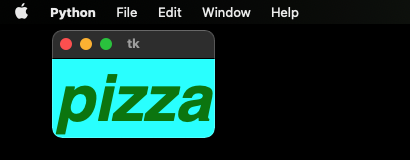
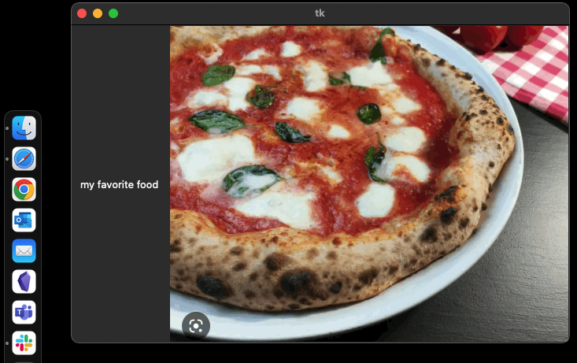
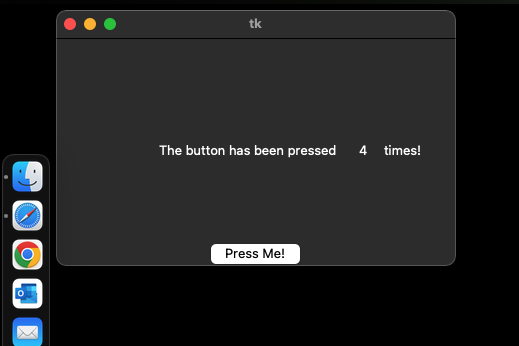
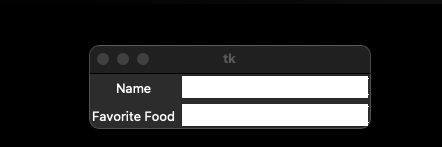
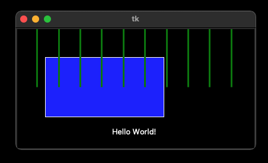

# 3.6. Tkinter Widgets

Now that we know how to create windows and organize objects, we can run through some of the most commonly-used widgets 
and some of their options. For a more complete list, see here:
[https://docs.python.org/3/library/tkinter.html](https://docs.python.org/3/library/tkinter.html)

## Label

### Changing font size and color
We've already introduced the basics of labels, but there are a few more interesting things to cover. Label widgets have 
many more options:
```python
import tkinter as tk
main_window = tk.Tk()

new_label = tk.Label(text="pizza",
                     fg = "yellow",
                     bg = "cyan",
                     font = "Helvetica 16 bold italic")
new_label.pack()

main_window.mainloop()
```



### Using Images in Labels

It is easy to use an image in a tkinter program, you can just attach one to a label widget.
```python
import tkinter as tk

main_window = tk.Tk()

logo = tk.PhotoImage(file="pizza.gif")
image_label = tk.Label(main_window, image=logo)
image_label.pack(side="right")

text_label = tk.Label(main_window, 
              justify=tk.LEFT,
              padx = 10, 
              text="my favorite food")
text_label.pack(side="left")

main_window.mainloop()
```



## Button Widgets

Many button options can be modified, like its size and shape and properties of the text in the button.

The main use of buttons is to make something in your program happen. Next week we will talk a lot more about creating 
functions, but here we will quickly show you how you create a function of your own to do something when a button is 
pressed.

Functions start with the "def" command, and then the name of the function followed by parentheses and a colon.
Then you just put the code for the function inside it, tabbed over.

```python
import tkinter as tk

counter = 0

def change_label():
    global counter
    counter += 1
    label2.config(text=str(counter))

main_window = tk.Tk()
main_frame = tk.Frame(main_window, height=200, width=400)
main_frame.pack()

label1 = tk.Label(main_frame, text="The button has been pressed")
label1.place(x=100, y=100)
label2 = tk.Label(main_frame, text=str(counter))
label2.place(x=300, y=100)
label3 = tk.Label(main_frame, text="times!")
label3.place(x=325, y=100)

new_button = tk.Button(main_window, text="Press Me!", command=change_label)
new_button.pack()

main_window.mainloop()
```


We create the function and put the code we want to run inside 
it. The first line in the function is telling the function that counter is a global variable. A global variable is any 
variable defined out in the main level of your python script, all the way to the left. The second line says that any 
time the function runs, the counter variable should be incremented by 1. The third line changes the text in label2 to 
whatever the value of counter is (after converting it to a string, if you try to use an integer as the text for a label,
you will get an error).

## Entry Widgets

An entry widget is a way to get text data from the user. 

```python
import tkinter as tk

main_window = tk.Tk()

tk.Label(main_window, text="Name").grid(row=0)
tk.Label(main_window, text="Favorite Food").grid(row=1)

name_entry = tk.Entry(main_window, bg="white")
name_entry.grid(row=0, column=1)

food_entry = tk.Entry(main_window, bg="white")
food_entry.grid(row=1, column=1)

main_window.mainloop()
```


To actually get the data and store it in a variable, you would need to pair it with a "Submit" button. The button 
could call a function called "def get_entry_data()" that looks like this:

```python
def get_entry_data():
    name = name_entry.get()
    favorite_food = food_entry.get()
```
Entry widgets have a .get() method, which you can use to get whatever data is currently typed into them. It will be 
stored as a string, so if you are getting number input, you will need to convert it.


## Canvas Widgets

The canvas widget is a place for graphics. You can draw lines and shapes, load pictures, and write text. The only thing 
to remember about canvas widgets is that you can't put other kinds of widgets inside of them. In other words, you can't 
put a button or a label in a canvas. If you want to add text or an image to a canvas you can, but you do it a different 
way.

```python
import tkinter as tk

main_window = tk.Tk()

canvas_height = 200
canvas_width = 400

main_canvas = tk.Canvas(main_window, 
						width=canvas_width, 
						height=canvas_height,
						bg="black")
main_canvas.pack()

main_canvas.create_rectangle(50, 50, 250, 150, fill="blue")

x = 0
num_lines = 11
x_increment = canvas_width/num_lines

for i in range(num_lines):
	main_canvas.create_line(x, 0, x, 100, fill="green", width=3)
	x += x_increment

main_canvas.create_text(200, 175, text="Hello World!")

main_window.mainloop()
```


A couple of things to note in this code. When we created the canvas, we can specify its height and weight. But notice 
that we did this in a variable, then assigned the variable. Why do it this way? Now that number is available if we want 
to use it elsewhere in the application. 

When creating rectangles, you have to specify four numbers. These are the top left and bottom right x,y coordinates of 
the rectangle. We can set the color and border color and all sorts of other properties of shapes like rectangles. There 
are also many other shapes we can make: ovals, circles, and polygons, where you can just specify a list of coordinates 
in order and it will connect the points to make a shape.

Drawing lines is very similar, you specify four points, the starting x,y and the ending x,y, as well as the color and 
width of the line. Note here that we created 11 lines with a loop. Why 11? Well I wanted to divide the canvas into 10 
equal parts using the lines, like the marks on a football field. Here is where having the width saved as a variable 
came in handy. I can figure out how much I need to change the x coordinate of each line by just dividing the width by 
11, and then incrementing the value of x each time through the loop. This is nice because if I change the width of the 
canvas, everything still works exactly as intended.

Next: [3.7. Lab 3](3.7.%20Lab%203.md)<br>
Previous: [3,5. Tkinter Layout Management](3.5.%20Tkinter%20Layout%20Management.md)
