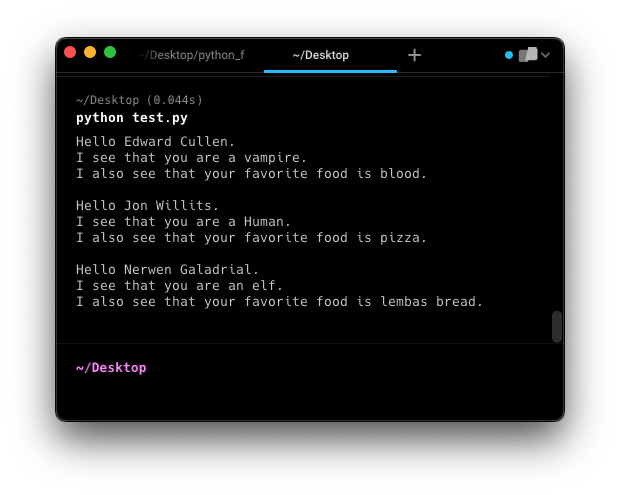

# 4.1 Passing Arguments into Functions

As we noted, it is common to pass data into a function. You will sometimes hear these called parameters, and sometimes 
hear them called arguments. The terms technically mean slightly different things. We call the variable that is defined 
in the function a parameter, and we call it an argument when we are talking about the actual values that are assigned to 
those variables when the function is called. Consider, for example, the following function for computing and printing 
out some properties of a circle:

```python
def print_circle_info(x, y, radius):
    center = (x, y)
    pi = 3.1415
    
    circumference = 2 * pi * radius
    
    area = pi * radius**2
    
    top_tangent_point = (x, y - radius)
    bottom_tangent_point = (x, y + radius)

    print("Your circle has an area of {:0.3f} and a circumference of {:0.3f}".format(area, circumference))
    print("The center of the circle is {}".format(center))
    print("It's top and bottom tangent points are {} and {}".format(top_tangent_point, bottom_tangent_point))

    
center = (5, 3)
the_radius = 4
print_circle_info(center[0], center[1], the_radius)
```

The "print_circle info" function has three parameters: the x and y coordinates at the middle of the circle, and its
radius. The values 5, 3, and 4 are what we would consider the current arguments of print_circle info when it is called 
on the last line of the code above.

Because the function has three parameters, every time the function is called it must be supplied with three arguments.
This is the default behavior for python functions, the number of parameters and the number of arguments must match. The 
arguments that are passed into the function are assigned to the parameters in the order that they are specified. If one 
accidentally screwed up the order of the arguments by doing the following:
```python
print_circle_info(the_radius, center[0], center[1])
```

Python would have no way of knowing that the_radius was supposed to be assigned to the third parameter. It isn't smart 
like that, and it can't match the names. It just matches them up by order. So in this case, the value in the_radius (4) 
would get assigned to x, the value in x (5) would get assigned to y, and the value in y (3) would get assigned to the 
radius.

As a general rule, the number of arguments (values passed in) and parameters (variables defined in the function 
definition) must match. But there is one important exception which we will discuss next.

## Default Arguments for Parameters

You can define a function to have a default value for a parameter in the event that it is not specified:
```python
def print_location(location="Champaign"):
    
    print("You live in {}!".format(location))

print_location()

city = "Urbana"
print_location(city)
```

In the example above, when the parameter location is defined inside the function, the parameter is also assigned a 
value. This value will be automatically assigned to the variable if that argument is not passed into the function. So in
this example we have a function with a single optional parameter, and so it can be called with either one or zero 
arguments provided.

It may occur to you that if you can have parameters with default arguments, then that creates a confusing situation when 
you mix parameters with and without defaults. Parameters without defaults match the arguments to the parameters in the 
order they are supplied, and so optional arguments would screw this up because it would make the order or the arguments 
unpredictable. For this reason, Python requires that all parameters without arguments be defined first, and optional 
arguments come after that. See the example below.

```python
def print_personal_info(first_name, last_name, species="Human", favorite_food=None):
    
    print("Hello {} {}.".format(first_name, last_name))
    
    # check to see if the species name starts with a vowel, so we use the correct article before it
    if species[0] in ['A', 'E', "I", "O", "U", "a", "e", "i", "o", "u"]:
        article = "an"
    else:
        article = "a"
        
    print("I see that you are {} {}.".format(article, species))
    
    if favorite_food:
        print("I also see that your favorite food is {}.".format(favorite_food))
    else:
        print("I do not know what your favorite food is.")

print_personal_info("Edward", "Cullen", "vampire", "blood")
print_personal_info("Jon", "Willits", favorite_food="pizza")
print_personal_info("Nerwen", "Galadrial", favorite_food="lembas bread", species="elf")
```


In this example, we have a function that prints some information about a person. The function has two required 
parameters (first_name and last_name) and two optional parameters (species and favorite_food). In the function 
definition, the optional parameters must come at the end of the sequence of defined parameters.

Notice that when the functions are called, there are options about how to provide arguments.
- In all cases the required arguments must come first
- If the optional arguments are provided in the order they are defined (like in the first example), you don't need to 
specify the parameter names; they work just normal parameters
- If you want to provide an optional argument that is not the next one in the definition order, then you must specify 
the parameter's name (as in the second example)
- You can specify any of the optional arguments, in any order, as long as you use the parameter name when you call the 
    function (as in the third example)

There is another useful detail worth pointing out in this example. If you define a function with optional parameters, 
you can assign any kind of variable as the default. In the case of species above, we supplied a string. But in the case 
of favorite_food, we provide the value "None". Remember that "None" is a special kind of variable type all of its own.
It is common in defining functions with optional variables to declare its default value as "None", because that allows 
us to perform a simple boolean check to see if the variable has a value, as we do in this function. When we use the 
command "if favorite_food:", if favorite_food is None, the if statement evaluates as False. That allows us to set up a 
nice bit of code that will run as a default if one of our variables doesn't have a value.

Next: [4.2. Return Values](4.2.%20Return%20Values.md)<br>
Previous: [4.0. Functions](4.0%20Functions.md)